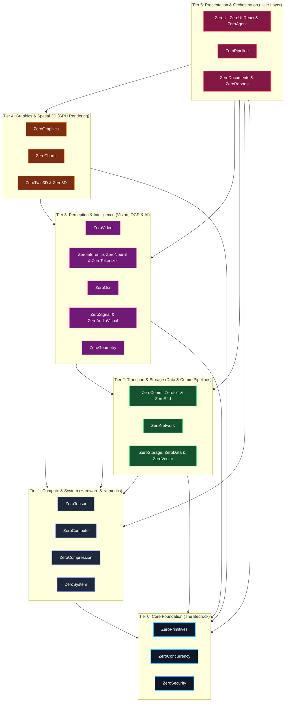

# ZeroPlatform: Unified Industrial .NET Ecosystem

[](LICENSE)
[](https://dotnet.microsoft.com/)
[-brightgreen.svg)]()
[](docs/ZERO_PLATFORM_ECOSYSTEM.md)
[](docs/architect/tier-taxonomy-specification.md)

**ZeroPlatform** is a sovereign, enterprise-grade software ecosystem for industrial automation, computer vision, digital signal processing (DSP), edge AI, high-speed time-series persistence, and hardware-accelerated HMI/SCADA visual studio controls.

👉 **[6-Tier Architecture Spec](docs/architect/platform-architecture.md)** | **[Tier Governance Spec (SPEC-ARCH-001)](docs/architect/tier-taxonomy-specification.md)** | **[ISA-101 Industrial HMI Handbook (STD-HMI-001)](docs/standards/industrial-hmi-design.md)** | **[Git Standards & Repo Directory (GOV-REPO-001)](docs/governance/subsystem-catalog-and-git-descriptions.md)** | **[Subsystem Catalog](docs/ZERO_PLATFORM_ECOSYSTEM.md)**

---

## 🏛️ Ecosystem Architecture (6-Tier Strict DAG)


```mermaid
graph TD
    classDef l0 fill:#0f172a,stroke:#38bdf8,stroke-width:2px,color:#fff;
    classDef l1 fill:#1e293b,stroke:#818cf8,stroke-width:2px,color:#fff;
    classDef l2 fill:#14532d,stroke:#4ade80,stroke-width:2px,color:#fff;
    classDef l3 fill:#701a75,stroke:#f472b6,stroke-width:2px,color:#fff;
    classDef l4 fill:#7c2d12,stroke:#fb923c,stroke-width:2px,color:#fff;
    classDef l5 fill:#831843,stroke:#f43f5e,stroke-width:2px,color:#fff;

    subgraph L5 ["Tier 5: Presentation & Orchestration (User Layer)"]
        UI["ZeroUI, ZeroUI.React & ZeroAgent"]:::l5
        Pipe["ZeroPipeline"]:::l5
        Docs["ZeroDocuments & ZeroReports"]:::l5
    end

    subgraph L4 ["Tier 4: Graphics & Spatial 3D (GPU Rendering)"]
        Gfx["ZeroGraphics"]:::l4
        Charts["ZeroCharts"]:::l4
        Twin["ZeroTwin3D & Zero3D"]:::l4
    end

    subgraph L3 ["Tier 3: Perception & Intelligence (Vision, OCR & AI)"]
        Video["ZeroVideo"]:::l3
        Infer["ZeroInference, ZeroNeural & ZeroTokenizer"]:::l3
        Ocr["ZeroOcr"]:::l3
        Sig["ZeroSignal & ZeroAudioVisual"]:::l3
        Geom["ZeroGeometry"]:::l3
    end

    subgraph L2 ["Tier 2: Transport & Storage (Data & Comm Pipelines)"]
        Comm["ZeroComm, ZeroIoT & ZeroRfid"]:::l2
        Net["ZeroNetwork"]:::l2
        Store["ZeroStorage, ZeroData & ZeroVector"]:::l2
    end

    subgraph L1 ["Tier 1: Compute & System (Hardware & Numerics)"]
        Tensor["ZeroTensor"]:::l1
        Comp["ZeroCompute"]:::l1
        Compres["ZeroCompression"]:::l1
        Sys["ZeroSystem"]:::l1
    end

    subgraph L0 ["Tier 0: Core Foundation (The Bedrock)"]
        Prim["ZeroPrimitives"]:::l0
        Conc["ZeroConcurrency"]:::l0
        Sec["ZeroSecurity"]:::l0
    end

    L5 --> L4 & L3 & L2 & L1 & L0
    L4 --> L3 & L1 & L0
    L3 --> L2 & L1 & L0
    L2 --> L1 & L0
    L1 --> L0
```

---

## 📜 Subsystems Classified by Architectural Tier

### Tier 0: Core Foundation (The Bedrock - Zero Dependencies)
| Subsystem | Repository | Key Capabilities |
| :--- | :--- | :--- |
| **`ZeroPrimitives`** | [`kzxl/ZeroPrimitives`](https://github.com/kzxl/ZeroPrimitives) | Pure C# zero-allocation primitive conversions, SSE4.2 CRC32C, unmanaged polymorphic struct pooling (`StructArenaPool`), span/pointer parsers, fast hex/base64, compiled object mapper. |
| **`ZeroConcurrency`** | [`kzxl/ZeroConcurrency`](https://github.com/kzxl/ZeroConcurrency) | Pure C# lock-free SPSC/MPMC ring buffers, execution-context bypassing schedulers, zero-allocation pooled `ValueTask` sources, and Go-like CSP channels. |
| **`ZeroSecurity`** | [`kzxl/ZeroSecurity`](https://github.com/kzxl/ZeroSecurity) | Pure C# cryptographic suite: BLAKE3/FastSha256, HMAC, HKDF, PBKDF2, Cuckoo/Bloom Filter, X25519 ECDH, ChaCha20/Poly1305. |

### Tier 1: Compute & System (Hardware & Numerics)
| Subsystem | Repository | Key Capabilities |
| :--- | :--- | :--- |
| **`ZeroSystem`** | [`kzxl/ZeroSystem`](https://github.com/kzxl/ZeroSystem) | Sovereign Windows native subsystem, hardware inventory telemetry (CPU, GPU, RAM, Storage, Network), and OS diagnostics. |
| **`ZeroCompression`** | [`kzxl/ZeroCompression`](https://github.com/kzxl/ZeroCompression) | Streaming multi-codec compression (Zstandard, LZMA, Brotli, Gorilla float TSDB codec), sub-ms heuristic classifier, AES-256-GCM AEAD, TAR/ZIP containers. |
| **`ZeroTensor`** | [`kzxl/ZeroTensor`](https://github.com/kzxl/ZeroTensor) | N-D strided memory layout, BFloat16 (`BFloat16`) instant bitshift conversions, INT4 packed quantization (`GemmInt4`), Level-3 BLAS (GEMM), mixed-precision arithmetic, SVD/QR/Cholesky matrix decompositions, Safetensors/Npy. |
| **`ZeroCompute`** | [`kzxl/ZeroCompute`](https://github.com/kzxl/ZeroCompute) | 5-level CPU Parallel Compute Runtime (cache-aware tiling, SIMD Padé approximations, cross-platform physical core affinity), dual-socket NUMA awareness (`NumaTopology`), and Direct3D 11 GPU Compute Shaders. |
| **`ZeroAsset`** | [`kzxl/ZeroAsset`](https://github.com/kzxl/ZeroAsset) | Digital asset management (DAM), zero-byte variant branching (`#vc<n>`), hierarchical contiguous sorting, asset curation & cache keys. |

### Tier 2: Transport & Storage (Data & Comm Pipelines)
| Subsystem | Repository | Key Capabilities |
| :--- | :--- | :--- |
| **`ZeroNetwork`** | [`kzxl/ZeroNetwork`](https://github.com/kzxl/ZeroNetwork) | High-performance network infrastructure, IP/CIDR math, IEEE OUI filtering, ARP table, WoL, parallel port scanner, embedded micro-HTTP server. |
| **`ZeroComm`** | [`kzxl/ZeroComm`](https://github.com/kzxl/ZeroComm) | Asynchronous low-latency TCP/Serial transport (`TCP_NODELAY`), circular DMA ring buffers, Modbus TCP/RTU master, Mitsubishi 3E Binary, Omron FINS. |
| **`ZeroIoT`** | [`kzxl/ZeroIoT`](https://github.com/kzxl/ZeroIoT) | Industrial IoT edge connectors, MQTT 3.1.1/5.0 client with Exactly-Once QoS 2 (`PUBREC`/`PUBREL`/`PUBCOMP`) & in-flight tracking (`Qos2FlightTable`), OPC UA client with X.509 mTLS encryption, and TSDB streaming bridge. |
| **`ZeroRfid`** | [`kzxl/ZeroRfid`](https://github.com/kzxl/ZeroRfid) | EPC Gen2 / ISO 18000-6C suite, UHF reader adapters, sliding-window anti-collision deduplication pipeline & simulator. |
| **`ZeroStorage`** | [`kzxl/ZeroStorage`](https://github.com/kzxl/ZeroStorage) | Embedded TSDB, Facebook Gorilla Delta-of-Delta + XOR float compression (1.37 B/sample), MMF zero-copy persistence, IoT out-of-order ingestion, CRC32 WAL. |
| **`ZeroData`** | [`kzxl/ZeroData`](https://github.com/kzxl/ZeroData) | Columnar DataFrame, SIMD relational hash joins (Inner/Left/Right/Outer), compiled expression tree SQL materializers, pure C# Arrow IPC. |
| **`ZeroVector`** | [`kzxl/ZeroVector`](https://github.com/kzxl/ZeroVector) | High-throughput embedded Vector Database & SIMD similarity engine, AVX2/FMA metrics (Cosine, DotProduct, Euclidean, Manhattan, Hamming), Flat contiguous index & HNSW graph index. |

### Tier 3: Perception & Intelligence (Signal, Vision, OCR & AI)
| Subsystem | Repository | Key Capabilities |
| :--- | :--- | :--- |
| **`ZeroSignal`** | [`kzxl/ZeroSignal`](https://github.com/kzxl/ZeroSignal) | In-place Cooley-Tukey FFT, real-time STFT spectrogram, zero-phase Butterworth `FiltFilt`, Extended Kalman Filter (EKF), VAD voice activity detector. |
| **`ZeroGeometry`** | [`kzxl/ZeroGeometry`](https://github.com/kzxl/ZeroGeometry) | 3D ICP rigid cloud alignment, KdTree3D/RTree2D spatial queries, surface normal estimation, Sutherland-Hodgman clipping, 2D Delaunay triangulation, 2D Homography DLT & RANSAC. |
| **`ZeroVideo`** | [`kzxl/ZeroVideo`](https://github.com/kzxl/ZeroVideo) | Industrial Motion JPEG client, RTSP 1.0 session transport, RFC 3550 RTP demuxing, H.264 NALU scanner & Exp-Golomb SPS parser, zero-LOH `VideoFramePool`, PTS playback. |
| **`ZeroAudioVisual`** | [`kzxl/ZeroAudioVisual`](https://github.com/kzxl/ZeroAudioVisual) | Acoustic predictive maintenance, multi-channel microphone array beamforming & audio-visual defect localization. |
| **`ZeroInference`** | [`kzxl/ZeroInference`](https://github.com/kzxl/ZeroInference) | Polymorphic `IInferenceSession`, Pure C# ONNX binary model parser, Transformer operators (RoPE `RotaryEmbedding`, CPU cache-tiled `FlashAttentionKernel`), CPU execution graph & OnnxRuntime GPU providers, YOLOv8/v11 decoders. |
| **`ZeroNeural`** | [`kzxl/ZeroNeural`](https://github.com/kzxl/ZeroNeural) | PyTorch-like reverse-mode automatic differentiation (Autograd) DAG tape, neural layers (`Linear`, `Sequential`, `Conv2D`, `Dropout`), AdamW/SGD. |
| **`ZeroOcr`** | [`kzxl/ZeroOcr`](https://github.com/kzxl/ZeroOcr) | Pure C# zero-allocation OCR abstractions, AVX2 SIMD preprocessor (ITU-R BT.601, binarization), dot-matrix morphology, HPP projection deskewing, parallel multi-ROI inspection, and native Windows WinRT OCR engine. |
| **`ZeroTokenizer`** | [`kzxl/ZeroTokenizer`](https://github.com/kzxl/ZeroTokenizer) | Pure C# Byte-Pair Encoding (BPE), Tiktoken regex-aware tokenization (`cl100k_base`, `o200k_base`, LLaMA-3), and Knapsack context token budgeter. |

### Tier 4: Graphics & Spatial 3D (GPU Rendering)
| Subsystem | Repository | Key Capabilities |
| :--- | :--- | :--- |
| **`ZeroGraphics`** | [`kzxl/ZeroGraphics`](https://github.com/kzxl/ZeroGraphics) | Render Hardware Interface (RHI - Null, D3D11, and cross-platform Vulkan 1.0+ `VulkanRhiDevice`), COM VTable D3D11/D2D, pure C# Graphics Interception (`ComVTableHook`), Standardized Color Spaces & Bradford adaptation, Zero-LOH NCC & blur, 144Hz waveforms, Barcode HRI suite. |
| **`ZeroCharts`** | [`kzxl/ZeroCharts`](https://github.com/kzxl/ZeroCharts) | Direct2D GPU high-density telemetry strip charts, dynamic multi-axis graphs, and real-time streaming data visualizers. |
| **`ZeroTwin3D`** | [`kzxl/ZeroTwin3D`](https://github.com/kzxl/ZeroTwin3D) | Pure C# 3D digital twin spatial scene graph, Wavefront OBJ & glTF 2.0 / GLB 3D model loaders, Direct3D 11 rendering pipeline, orbit/fly camera navigation. |
| **`Zero3D`** | [`kzxl/Zero3D`](https://github.com/kzxl/Zero3D) | General-purpose 3D mathematics, camera matrices, lighting models, and geometry mesh rendering. |

### Tier 5: Presentation & Orchestration (User Layer & Reporting)
| Subsystem | Repository | Key Capabilities |
| :--- | :--- | :--- |
| **`ZeroDocuments`** | [`kzxl/ZeroDocuments`](https://github.com/kzxl/ZeroDocuments) | Pure C# zero-dependency OpenXML Excel (.xlsx) reader/writer and RFC 4180 CSV tokenizer/parser. |
| **`ZeroReports`** | [`kzxl/ZeroReports`](https://github.com/kzxl/ZeroReports) | Pure C# high-speed PDF & industrial thermal barcode label rendering without GDI+ (ZPL/TSPL/ESC-POS emulation). |
| **`ZeroPipeline`** | [`kzxl/ZeroPipeline`](https://github.com/kzxl/ZeroPipeline) | Directed acyclic graph (DAG) scheduler (Kahn sort), industrial inspection & vision nodes (Color Space, Homography 2D, Caliper, Barcode, OCR Inspection, AI), declarative JSON recipes, and visual node canvas. |
| **`ZeroUI`** | [`kzxl/ZeroUI`](https://github.com/kzxl/ZeroUI) | ISA-101 Industrial HMI Design System Handbook (`STD-HMI-001`), Obsidian Dark ergonomics (`#11131F`), 48px+ touch targets, 10M+ rows virtual grid, single-HWND D3DCanvas, 40+ industrial SCADA controls, Media & Creative Editors Suite. |
| **`ZeroUI.React`** | [`kzxl/ZeroUI.React`](https://github.com/kzxl/ZeroUI.React) | Enterprise & Industrial React component suite for SCADA, connected button clusters, universal theme token synchronization with Desktop. |
| **`ZeroAgent`** | [`kzxl/ZeroAgent`](https://github.com/kzxl/ZeroAgent) | Autonomous AI Agent framework, deterministic ReAct reasoning loop, zero-reflection tool execution, semantic episodic memory via `ZeroVector`, and CSP multi-agent swarm coordination. |

---

## ⚡ Quick Start

### 1. Synchronize All 31 Subsystems
```powershell
.\clone-ecosystem.ps1
```

### 2. Build Entire Solution
```bash
dotnet build ZeroPlatform.slnx
```

### 3. Run Full Test Suite (>1,500 Tests, 100% Pass Rate)
```bash
dotnet test ZeroPlatform.slnx
```

### 4. Launch Unified Showcase Application
```bash
dotnet run --project samples/ZeroPlatform.Samples.Showcase/ZeroPlatform.Samples.Showcase.csproj -f net8.0-windows
```

---

## 📄 Authors & License

Architected and developed by **Phong Võ** (`kzxl`). Released under the **MIT License**.
