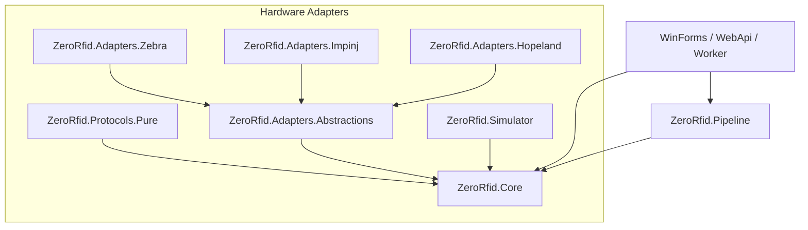

# ZeroRfid

[](LICENSE)
[](https://dotnet.microsoft.com/)
[-brightgreen.svg)]()
[](https://www.nuget.org/packages/ZeroRfid.Core)

**ZeroRfid** is a high-throughput, sovereign RFID reader communication, tag streaming, and edge processing library for .NET with **zero external dependencies** in its core. Built for industrial manufacturing, smart warehouse gates, and conveyor tracking, it delivers Ports & Adapters hardware isolation, sliding-window deduplication, portal gate vector direction detection, and a realistic scenario-based simulator.

---

## 🌟 Sub-Packages & Architecture



| Package | Description | Target Frameworks |
| :--- | :--- | :--- |
| **`ZeroRfid.Core`** | Sovereign interfaces (`IRfidReader`, `IRfidMemoryAccess`, `IRfidGpioController`), normalized `TagReadEvent`, EPC hex codecs, and GS1 TDS decoders. | `netstandard2.0;net462;net8.0` |
| **`ZeroRfid.Adapters.Abstractions`** | Extensible vendor SDK adapter base classes, event synchronization, and raw hardware unit normalizers. | `netstandard2.0;net462;net8.0` |
| **`ZeroRfid.Pipeline`** | High-throughput streaming filters: sliding-window tag deduplication, RSSI threshold cut-off, and real-time portal gate vector direction detection. | `netstandard2.0;net462;net8.0` |
| **`ZeroRfid.Simulator`** | Scenario-based virtual reader (warehouse gate passing, conveyor belts, shelf bursts, virtual memory banks & GPIO) for hardware-free development. | `netstandard2.0;net462;net8.0` |

---

## 📦 Installation

Install via the .NET CLI:
```bash
dotnet add package ZeroRfid.Core
dotnet add package ZeroRfid.Pipeline
dotnet add package ZeroRfid.Simulator
dotnet add package ZeroRfid.Adapters.Abstractions
```

---

## 🚀 Quick Start

### 1. Connecting and Streaming Tags with the Simulator
```csharp
using ZeroRfid.Core.Abstractions;
using ZeroRfid.Core.Models;
using ZeroRfid.Simulator;

// 1. Initialize simulator reader with a warehouse gate scenario
var options = new SimulatorOptions
{
    Scenario = SimulationScenario.WarehouseGateInbound,
    TagCount = 10,
    EmissionIntervalMs = 25
};

await using IRfidReader reader = new SimulatorRfidReader("READER-GATE-01", options);
await reader.ConnectAsync();

// 2. Start continuous inventory
await reader.StartInventoryAsync();

// 3. Stream tags asynchronously with cancellation
using var cts = new CancellationTokenSource(TimeSpan.FromSeconds(5));
await foreach (TagReadEvent tag in reader.ReadTagsAsync(cts.Token))
{
    Console.WriteLine($"[Scanned] EPC={tag.Epc} | Ant={tag.AntennaId} | RSSI={tag.Rssi:F1} dBm");
}
```

### 2. High-Throughput Sliding-Window Deduplication
```csharp
using ZeroRfid.Pipeline.Deduplication;

var dedupFilter = new TagDeduplicationFilter(new DeduplicationOptions
{
    SlidingWindow = TimeSpan.FromSeconds(1),
    RssiMode = RssiAggregationMode.Maximum
});

dedupFilter.TagAppeared += (_, tag) =>
{
    Console.WriteLine($"✅ New tag detected: {tag.Epc} on Antenna {tag.AntennaId}");
};

dedupFilter.TagDisappeared += (_, tag) =>
{
    Console.WriteLine($"⏳ Tag left RF zone: {tag.Epc} after {tag.ReadCount} total reads");
};

// Process incoming raw tags (duplicates within 1 second are automatically suppressed)
TagReadEvent? emitted = await dedupFilter.ProcessAsync(rawTag);
```

### 3. Portal Gate Vector Direction Detection (Inbound / Outbound)
```csharp
using ZeroRfid.Pipeline.Direction;

using var gateResolver = new PortalGateDirectionResolver(
    inboundAntenna: 1, 
    outboundAntenna: 2, 
    passageWindow: TimeSpan.FromSeconds(3));

gateResolver.DirectionResolved += (_, eval) =>
{
    Console.WriteLine($"🚪 Portal Transit: Tag {eval.Epc} -> {eval.Direction} ({eval.Confidence * 100:F0}% confidence)");
};

// Feed stream of antenna detections
await gateResolver.ProcessAsync(tagEvent);
```

### 4. Tag Memory Operations & Industrial GPIO
```csharp
if (reader is IRfidMemoryAccess mem)
{
    // Rewrite tag EPC
    await mem.WriteEpcAsync("30340001A1B2C3D4E5F60001", "E28011602000000011223344");
}

if (reader is IRfidGpioController gpio)
{
    // Activate industrial tower light on GPO Pin 1
    await gpio.SetGpoAsync(pinIndex: 1, isHigh: true);
}
```

---

## 📄 License

MIT License © 2026 Phong Võ. Part of the **ZeroPlatform** project.
