# 🌌 ZeroPlatform Ecosystem: The Sovereign .NET Industrial Automation Suite

> **Architectural Standard**: 100% Pure C#, Zero External Dependencies, Zero Commercial Licenses, Multi-Targeting across `.NET 8.0+`, `.NET Framework 4.6.2+`, and `.NET Standard 2.0`.

The **ZeroPlatform** is a comprehensive, modular software suite engineered for mission-critical industrial automation, computer vision, digital signal processing (DSP), edge AI inference, high-speed time-series persistence, and hardware-accelerated HMI/SCADA visual studio controls.

---

## 🏛 Ecosystem Architecture (6-Tier Strict DAG)

```mermaid
graph TD
    classDef l0 fill:#0f172a,stroke:#38bdf8,stroke-width:2px,color:#fff;
    classDef l1 fill:#1e293b,stroke:#818cf8,stroke-width:2px,color:#fff;
    classDef l2 fill:#14532d,stroke:#4ade80,stroke-width:2px,color:#fff;
    classDef l3 fill:#701a75,stroke:#f472b6,stroke-width:2px,color:#fff;
    classDef l4 fill:#7c2d12,stroke:#fb923c,stroke-width:2px,color:#fff;
    classDef l5 fill:#831843,stroke:#f43f5e,stroke-width:2px,color:#fff;

    subgraph L5 ["Tier 5: Presentation & Orchestration (User Layer)"]
        ZeroUI["🖥️ ZeroUI<br/><i>Virtual Grid, HMI Controls & WPF</i>"]:::l5
        ZeroUIReact["⚛️ ZeroUI.React<br/><i>Web HMI & Connected Clusters</i>"]:::l5
        ZeroPipeline["🔗 ZeroPipeline<br/><i>DAG Engine, Metrology & Canvas</i>"]:::l5
        ZeroReports["🖨️ ZeroReports<br/><i>PDF & Thermal Barcode Labels</i>"]:::l5
        ZeroDocuments["📄 ZeroDocuments<br/><i>Pure C# Excel & CSV Engine</i>"]:::l5
    end

    subgraph L4 ["Tier 4: Graphics, 3D & Digital Twin (GPU Rendering)"]
        ZeroGraphics["🎨 ZeroGraphics<br/><i>RHI, Interception, Waveform & Vision</i>"]:::l4
        ZeroCharts["📈 ZeroCharts<br/><i>Direct2D Telemetry Graphs</i>"]:::l4
        ZeroTwin3D["🏢 ZeroTwin3D<br/><i>3D Digital Twin, glTF & OBJ</i>"]:::l4
        Zero3D["📐 Zero3D<br/><i>3D Mathematics, Mesh & Cameras</i>"]:::l4
    end

    subgraph L3 ["Tier 3: Perception, Vision & Intelligence (Signal & AI)"]
        ZeroVideo["📹 ZeroVideo<br/><i>RTSP, RTP, MJPEG & H.264 Scanner</i>"]:::l3
        ZeroInference["🧠 ZeroInference<br/><i>ONNX Parser, Int8 & YOLO Decoders</i>"]:::l3
        ZeroNeural["⚡ ZeroNeural<br/><i>Autograd Tape & Layer Training</i>"]:::l3
        ZeroSignal["📡 ZeroSignal<br/><i>FFT, STFT, FiltFilt & EKF</i>"]:::l3
        ZeroAudioVisual["🎙️ ZeroAudioVisual<br/><i>Beamforming & Acoustic Vision</i>"]:::l3
        ZeroGeometry["📐 ZeroGeometry<br/><i>ICP PointCloud, KdTree & Polygons</i>"]:::l3
    end

    subgraph L2 ["Tier 2: Transport & Storage (Data & Comm Pipelines)"]
        ZeroNetwork["🌍 ZeroNetwork<br/><i>CIDR Math, ARP & Micro-HTTP</i>"]:::l2
        ZeroComm["🔌 ZeroComm<br/><i>Modbus TCP/RTU, MC 3E & FINS</i>"]:::l2
        ZeroIoT["🌐 ZeroIoT<br/><i>MQTT & OPC UA Bridge</i>"]:::l2
        ZeroRfid["🏷️ ZeroRfid<br/><i>EPC Gen2 / ISO 18000-6C Suite</i>"]:::l2
        ZeroStorage["💾 ZeroStorage<br/><i>Gorilla XOR TSDB & WAL</i>"]:::l2
        ZeroData["📊 ZeroData<br/><i>Columnar DataFrame & Arrow IPC</i>"]:::l2
    end

    subgraph L1 ["Tier 1: Compute & System (Hardware & Numerics)"]
        ZeroSystem["🖥️ ZeroSystem<br/><i>Hardware Telemetry & Win32 Native</i>"]:::l1
        ZeroCompression["🗜️ ZeroCompression<br/><i>Multi-Codec, Gorilla & AEAD</i>"]:::l1
        ZeroTensor["🧱 ZeroTensor<br/><i>N-D Strided Tensors & BLAS</i>"]:::l1
        ZeroCompute["⚙️ ZeroCompute<br/><i>Direct3D 11 Compute & CPU SIMD</i>"]:::l1
    end

    subgraph L0 ["Tier 0: Core Foundation (The Bedrock)"]
        ZeroPrimitives["⚡ ZeroPrimitives<br/><i>Fast Parsing, CRC32C & Mapper</i>"]:::l0
        ZeroConcurrency["🔄 ZeroConcurrency<br/><i>Lock-Free Buffers, Channels & Workers</i>"]:::l0
        ZeroSecurity["🔐 ZeroSecurity<br/><i>BLAKE3, ChaCha20 & X25519</i>"]:::l0
    end

    L5 --> L4 & L3 & L2 & L1 & L0
    L4 --> L3 & L1 & L0
    L3 --> L2 & L1 & L0
    L2 --> L1 & L0
    L1 --> L0
```



---

## 📦 Complete 27-Repository Satellite Catalog

### Tier 0: Core Foundation (The Bedrock - Zero Dependencies)
| Repository | GitHub Remote | NuGet Package | Key Capabilities |
| :--- | :--- | :--- | :--- |
| **`ZeroPrimitives`** | [`kzxl/ZeroPrimitives`](https://github.com/kzxl/ZeroPrimitives) | `ZeroPrimitives.Core` | Pure C# zero-allocation primitive conversions, SSE4.2 CRC32C, span/pointer parsers, fast hex/base64, compiled object mapper. |
| **`ZeroConcurrency`** | [`kzxl/ZeroConcurrency`](https://github.com/kzxl/ZeroConcurrency) | `ZeroConcurrency` | Lock-free SPSC (`ZeroRingBuffer`) & MPMC (`ZeroMpmcRingBuffer`), CSP channels (`ZeroChannel`), pooled `ValueTask` sources (`ZeroPromise`), dedicated pinned threads (`ZeroDedicatedWorker`), ExecutionContext bypass. |
| **`ZeroSecurity`** | [`kzxl/ZeroSecurity`](https://github.com/kzxl/ZeroSecurity) | `ZeroSecurity` | Pure C# cryptographic suite: BLAKE3/FastSha256, HMAC, HKDF, PBKDF2, Cuckoo/Bloom Filter, X25519 ECDH, ChaCha20/Poly1305. |

### Tier 1: Compute & System (Hardware & Numerics)
| Repository | GitHub Remote | NuGet Package | Key Capabilities |
| :--- | :--- | :--- | :--- |
| **`ZeroSystem`** | [`kzxl/ZeroSystem`](https://github.com/kzxl/ZeroSystem) | `ZeroSystem.Core` | Sovereign Windows native subsystem, hardware inventory telemetry (CPU, GPU, RAM, Storage, Network), and OS diagnostics. |
| **`ZeroCompression`** | [`kzxl/ZeroCompression`](https://github.com/kzxl/ZeroCompression) | `ZeroCompression.Core` | Streaming multi-codec compression (Zstandard, LZMA, Brotli, Gorilla float TSDB codec), sub-ms heuristic classifier, AES-256-GCM AEAD, TAR/ZIP containers. |
| **`ZeroTensor`** | [`kzxl/ZeroTensor`](https://github.com/kzxl/ZeroTensor) | `ZeroTensor.Core` | N-D strided memory layout, zero-copy slicing, Level-3 BLAS (GEMM), SVD/QR/Cholesky matrix decompositions. |
| **`ZeroCompute`** | [`kzxl/ZeroCompute`](https://github.com/kzxl/ZeroCompute) | `ZeroCompute.Core` | Direct3D 11 Compute Shader dispatcher via COM VTable, UAV buffer/texture binding, and CPU AVX2 SIMD fallback kernels. |

### Tier 2: Transport & Storage (Data & Comm Pipelines)
| Repository | GitHub Remote | NuGet Package | Key Capabilities |
| :--- | :--- | :--- | :--- |
| **`ZeroNetwork`** | [`kzxl/ZeroNetwork`](https://github.com/kzxl/ZeroNetwork) | `ZeroNetwork.Core` | High-performance network infrastructure, IP/CIDR math, IEEE OUI filtering, ARP table, WoL, parallel port scanner, embedded micro-HTTP server. |
| **`ZeroComm`** | [`kzxl/ZeroComm`](https://github.com/kzxl/ZeroComm) | `ZeroComm.Core` | Asynchronous low-latency TCP/Serial transport (`TCP_NODELAY`), circular DMA ring buffers, Modbus TCP/RTU master, Mitsubishi 3E Binary, Omron FINS. |
| **`ZeroIoT`** | [`kzxl/ZeroIoT`](https://github.com/kzxl/ZeroIoT) | `ZeroIoT` | Industrial IoT edge connectors, MQTT client, OPC UA client and sensor telemetry bridge. |
| **`ZeroRfid`** | [`kzxl/ZeroRfid`](https://github.com/kzxl/ZeroRfid) | `ZeroRfid.Core` | EPC Gen2 / ISO 18000-6C suite, UHF reader adapters, sliding-window anti-collision deduplication pipeline & simulator. |
| **`ZeroStorage`** | [`kzxl/ZeroStorage`](https://github.com/kzxl/ZeroStorage) | `ZeroStorage.Core` | Embedded TSDB, Facebook Gorilla Delta-of-Delta + XOR float compression (1.37 B/sample), MMF zero-copy persistence, IoT out-of-order ingestion, CRC32 WAL. |
| **`ZeroData`** | [`kzxl/ZeroData`](https://github.com/kzxl/ZeroData) | `ZeroData.Core` | Columnar DataFrame, SIMD relational hash joins (Inner/Left/Right/Outer), compiled expression tree SQL materializers, pure C# Arrow IPC. |

### Tier 3: Perception & Intelligence (Signal, Vision & AI)
| Repository | GitHub Remote | NuGet Package | Key Capabilities |
| :--- | :--- | :--- | :--- |
| **`ZeroSignal`** | [`kzxl/ZeroSignal`](https://github.com/kzxl/ZeroSignal) | `ZeroSignal.Core` | In-place Cooley-Tukey FFT, real-time STFT spectrogram, zero-phase Butterworth `FiltFilt`, Extended Kalman Filter (EKF), VAD voice activity detector. |
| **`ZeroGeometry`** | [`kzxl/ZeroGeometry`](https://github.com/kzxl/ZeroGeometry) | `ZeroGeometry.Core` | 3D ICP rigid cloud alignment, KdTree3D/RTree2D spatial queries, surface normal estimation, Sutherland-Hodgman clipping, 2D Delaunay triangulation. |
| **`ZeroVideo`** | [`kzxl/ZeroVideo`](https://github.com/kzxl/ZeroVideo) | `ZeroVideo` | Industrial Motion JPEG client, RTSP 1.0 session transport, RFC 3550 RTP demuxing, H.264 NALU scanner & Exp-Golomb SPS parser, zero-LOH `VideoFramePool`, PTS playback. |
| **`ZeroAudioVisual`** | [`kzxl/ZeroAudioVisual`](https://github.com/kzxl/ZeroAudioVisual) | `ZeroAudioVisual` | Acoustic predictive maintenance, multi-channel microphone array beamforming & audio-visual defect localization. |
| **`ZeroInference`** | [`kzxl/ZeroInference`](https://github.com/kzxl/ZeroInference) | `ZeroInference.Core` | Polymorphic `IInferenceSession`, Pure C# ONNX binary model parser, CPU execution graph & OnnxRuntime GPU providers, YOLOv8/v11 decoders (detection, pose, segment). |
| **`ZeroNeural`** | [`kzxl/ZeroNeural`](https://github.com/kzxl/ZeroNeural) | `ZeroNeural.Core` | PyTorch-like reverse-mode automatic differentiation (Autograd) DAG tape, neural layers (`Linear`, `Sequential`, `Conv2D`, `Dropout`), AdamW/SGD. |

### Tier 4: Graphics & Spatial 3D (GPU Rendering)
| Repository | GitHub Remote | NuGet Package | Key Capabilities |
| :--- | :--- | :--- | :--- |
| **`ZeroGraphics`** | [`kzxl/ZeroGraphics`](https://github.com/kzxl/ZeroGraphics) | `ZeroGraphics.Core` | Render Hardware Interface (RHI - Null & D3D11) with explicit barriers & timeline fences, COM VTable D3D11/D2D, pure C# Graphics Interception (`ComVTableHook`), Zero-LOH NCC & Gaussian blur, AVX2 SIMD thresholding & color transforms, Async Staging Ring Buffer, 144Hz waveforms, Barcode HRI suite. |
| **`ZeroCharts`** | [`kzxl/ZeroCharts`](https://github.com/kzxl/ZeroCharts) | `ZeroCharts` | Direct2D GPU high-density telemetry strip charts, dynamic multi-axis graphs, and real-time streaming data visualizers. |
| **`ZeroTwin3D`** | [`kzxl/ZeroTwin3D`](https://github.com/kzxl/ZeroTwin3D) | `ZeroTwin3D` | Pure C# 3D digital twin spatial scene graph, Wavefront OBJ & glTF 2.0 / GLB 3D model loaders, Direct3D 11 rendering pipeline, orbit/fly camera navigation. |
| **`Zero3D`** | [`kzxl/Zero3D`](https://github.com/kzxl/Zero3D) | `Zero3D` | General-purpose 3D mathematics, camera matrices, lighting models, and geometry mesh rendering. |

### Tier 5: Presentation & Orchestration (User Layer & Reporting)
| Repository | GitHub Remote | NuGet Package | Key Capabilities |
| :--- | :--- | :--- | :--- |
| **`ZeroDocuments`** | [`kzxl/ZeroDocuments`](https://github.com/kzxl/ZeroDocuments) | `ZeroDocuments.Core` | Pure C# zero-dependency OpenXML Excel (.xlsx) reader/writer and RFC 4180 CSV tokenizer/parser. |
| **`ZeroReports`** | [`kzxl/ZeroReports`](https://github.com/kzxl/ZeroReports) | `ZeroReports` | Pure C# high-speed PDF & industrial thermal barcode label rendering without GDI+ (ZPL/TSPL/ESC-POS emulation). |
| **`ZeroPipeline`** | [`kzxl/ZeroPipeline`](https://github.com/kzxl/ZeroPipeline) | `ZeroPipeline.Core` | Directed acyclic graph (DAG) scheduler (Kahn sort), industrial inspection nodes, declarative JSON recipes, and interactive visual node canvas. |
| **`ZeroUI`** | [`kzxl/ZeroUI`](https://github.com/kzxl/ZeroUI) | `ZeroUI.Core` | 10M+ rows virtual grid, single-HWND D3DCanvas, 40+ industrial SCADA controls (PlantMimicCanvas P&ID, Gauges), Media & Creative Editors Suite, dark theme (`#12151C`). |
| **`ZeroUI.React`** | [`kzxl/ZeroUI.React`](https://github.com/kzxl/ZeroUI.React) | `@zeroui/react` | Enterprise & Industrial React component suite for SCADA, connected button clusters, universal theme token synchronization with Desktop. |

---

## 🚀 Cloning and Developing the Full Suite

To clone the entire ZeroPlatform ecosystem into a single unified directory structure:

```powershell
# 1. Clone the root orchestrator repository
git clone https://github.com/kzxl/ZeroPlatform.git
cd ZeroPlatform

# 2. Run the automated ecosystem sync script
.\clone-ecosystem.ps1
```

Once cloned, open `ZeroPlatform.slnx` in Visual Studio 2022+ or Rider to build, test, and run the complete suite across all 27 subsystems organized neatly by architectural tier.

---

## 🔄 CI/CD Packaging & NuGet Publication

Each individual repository contains `.github/workflows/publish-packages.yml` configured to:
1. Trigger automatically when a version tag (`v*`) is pushed or a Release is created.
2. Build and compile for all configured target frameworks in `Release` configuration.
3. Package `.nupkg` with embedded symbols and source linking.
4. Publish automatically to:
   - **GitHub Packages**: `https://nuget.pkg.github.com/kzxl/index.json`
   - **NuGet.org**: via OIDC Trusted Publishing or `NUGET_API_KEY`.

---

## 📄 Authors & License

Architected and developed by **Phong Võ** (`kzxl`). Released under the **MIT License**.
