```mermaid
graph TD
    subgraph "Layer 5: Orchestration, Inspection & HMI"
        ZeroPipeline["🔗 ZeroPipeline<br/><i>DAG Engine, Metrology & Canvas</i>"]
        ZeroUI["🖥️ ZeroUI<br/><i>Virtual Grid, HMI Controls & WPF</i>"]
        ZeroReports["🖨️ ZeroReports<br/><i>PDF & Thermal Barcode Labels</i>"]
    end

    subgraph "Layer 4: Graphics, 3D & Digital Twin"
        ZeroGraphics["🎨 ZeroGraphics<br/><i>RHI, D3D11, D2D, Waveform & Vision</i>"]
        ZeroTwin3D["🏢 ZeroTwin3D<br/><i>3D Digital Twin, glTF & OBJ</i>"]
        ZeroCharts["📈 ZeroCharts<br/><i>Direct2D Telemetry Graphs</i>"]
        ZeroAudioVisual["🎙️ ZeroAudioVisual<br/><i>Beamforming & Acoustic Vision</i>"]
    end

    subgraph "Layer 3: Domain Math, AI, DSP & Geometry"
        ZeroInference["🧠 ZeroInference<br/><i>ONNX Parser, Int8 & YOLO Decoders</i>"]
        ZeroNeural["⚡ ZeroNeural<br/><i>Autograd Tape & Layer Training</i>"]
        ZeroSignal["📡 ZeroSignal<br/><i>FFT, STFT, FiltFilt & EKF</i>"]
        ZeroGeometry["📐 ZeroGeometry<br/><i>ICP PointCloud, KdTree & Polygons</i>"]
    end

    subgraph "Layer 2: Industrial Comm, IoT & Security"
        ZeroComm["🔌 ZeroComm<br/><i>Modbus TCP/RTU, MC 3E & FINS</i>"]
        ZeroIoT["🌐 ZeroIoT<br/><i>MQTT & OPC UA Bridge</i>"]
        ZeroRfid["🏷️ ZeroRfid<br/><i>EPC Gen2 / ISO 18000-6C Suite</i>"]
        ZeroNetwork["🌍 ZeroNetwork<br/><i>CIDR Math, ARP & Micro-HTTP</i>"]
        ZeroSecurity["🔐 ZeroSecurity<br/><i>BLAKE3, ChaCha20 & X25519</i>"]
    end

    subgraph "Layer 1: Numerical Foundation, Data & Compute"
        ZeroPrimitives["⚡ ZeroPrimitives<br/><i>Fast Parsing, CRC32C & Mapper</i>"]
        ZeroTensor["🧱 ZeroTensor<br/><i>N-D Strided Tensors & BLAS</i>"]
        ZeroCompute["⚙️ ZeroCompute<br/><i>Direct3D 11 Compute & CPU SIMD</i>"]
        ZeroData["📊 ZeroData<br/><i>Columnar DataFrame & Arrow IPC</i>"]
        ZeroStorage["💾 ZeroStorage<br/><i>Gorilla XOR TSDB & WAL</i>"]
        ZeroDocuments["📄 ZeroDocuments<br/><i>Pure C# Excel & CSV Engine</i>"]
        ZeroSystem["🖥️ ZeroSystem<br/><i>Hardware Telemetry & Win32 Native</i>"]
    end

    %% Dependency Connections
    ZeroTensor --> ZeroCompute
    ZeroTensor --> ZeroInference
    ZeroTensor --> ZeroNeural
    ZeroTensor --> ZeroSignal
    ZeroTensor --> ZeroGeometry

    ZeroGraphics --> ZeroUI
    ZeroGraphics --> ZeroTwin3D
    ZeroGraphics --> ZeroPipeline
    ZeroStorage --> ZeroPipeline
    ZeroComm --> ZeroPipeline
    ZeroInference --> ZeroPipeline
    ZeroUI --> ZeroPipeline
```

# 🌌 ZeroPlatform Ecosystem: The Sovereign .NET Industrial Automation Suite

> **Architectural Standard**: 100% Pure C#, Zero External Dependencies, Zero Commercial Licenses, Multi-Targeting across `.NET 8.0+`, `.NET Framework 4.6.2+`, and `.NET Standard 2.0`.

The **ZeroPlatform** is a comprehensive, modular software suite engineered for mission-critical industrial automation, computer vision, digital signal processing (DSP), edge AI inference, high-speed time-series persistence, and hardware-accelerated HMI/SCADA visual studio controls.

---

## 🏛 Ecosystem Architecture

## 🏛 Ecosystem Architecture



---

## 📦 Complete 23-Repository Matrix & Catalog

| Repository | GitHub Remote | NuGet Packages | Key Capabilities | Dependencies |
| :--- | :--- | :--- | :--- | :--- |
| **`ZeroPrimitives`** | [`kzxl/ZeroPrimitives`](https://github.com/kzxl/ZeroPrimitives) | `ZeroPrimitives.Core` | Pure C# zero-allocation primitive conversions, SSE4.2 CRC32C, span/pointer parsers, fast hex/base64, compiled object mapper. | **Pure C#** (0 deps) |
| **`ZeroTensor`** | [`kzxl/ZeroTensor`](https://github.com/kzxl/ZeroTensor) | `ZeroTensor.Core` | N-D strided memory layout, zero-copy slicing, Level-3 BLAS (GEMM), SVD/QR/Cholesky matrix decompositions. | **Pure C#** (0 deps) |
| **`ZeroCompute`** | [`kzxl/ZeroCompute`](https://github.com/kzxl/ZeroCompute) | `ZeroCompute.Core` | Unified compute abstraction (`IComputeContext`), Direct3D 11 Compute Shader dispatcher via COM VTable, CPU AVX2 SIMD fallback. | `ZeroTensor` |
| **`ZeroData`** | [`kzxl/ZeroData`](https://github.com/kzxl/ZeroData) | `ZeroData.Core` | High-frequency columnar `DataFrame`, SIMD relational hash joins (Inner, Left, Right, Outer), temporal resampling, pure C# Apache Arrow IPC. | **Pure C#** (0 deps) |
| **`ZeroStorage`** | [`kzxl/ZeroStorage`](https://github.com/kzxl/ZeroStorage) | `ZeroStorage.Core` | Embedded time-series database (TSDB), Facebook Gorilla Delta-of-Delta + XOR float compression (1.37 B/sample), MMF zero-copy persistence, CRC32 WAL. | **Pure C#** (0 deps) |
| **`ZeroInference`** | [`kzxl/ZeroInference`](https://github.com/kzxl/ZeroInference) | `ZeroInference.Core` | Polymorphic `IInferenceSession`, Pure C# ONNX binary model parser, CPU execution graph & OnnxRuntime GPU providers, YOLOv8/v11 anchor-free decoders (detection, pose, segment). | `ZeroTensor` |
| **`ZeroNeural`** | [`kzxl/ZeroNeural`](https://github.com/kzxl/ZeroNeural) | `ZeroNeural.Core` | PyTorch-like reverse-mode automatic differentiation (Autograd) DAG tape, neural layers (`Linear`, `Sequential`, `Conv2D`, `Dropout`), AdamW/SGD optimizers. | `ZeroTensor` |
| **`ZeroSignal`** | [`kzxl/ZeroSignal`](https://github.com/kzxl/ZeroSignal) | `ZeroSignal.Core` | In-place Cooley-Tukey FFT, STFT spectrogram analysis, zero-phase Butterworth `FiltFilt` digital filtering, Extended Kalman Filter (EKF) sensor fusion. | `ZeroTensor` |
| **`ZeroGeometry`** | [`kzxl/ZeroGeometry`](https://github.com/kzxl/ZeroGeometry) | `ZeroGeometry.Core` | 3D laser scan alignment (Arun's SVD ICP), KdTree3D/RTree2D spatial indexing, surface normal eigenanalysis, Sutherland-Hodgman clipping, 2D Delaunay triangulation. | `ZeroTensor` |
| **`ZeroComm`** | [`kzxl/ZeroComm`](https://github.com/kzxl/ZeroComm) | `ZeroComm.Core` | Asynchronous TCP/Serial transport (`TCP_NODELAY`), circular DMA ring buffers, transaction multiplexing, Modbus TCP/RTU master, Mitsubishi MELSEC 3E, Omron FINS. | **Pure C#** (0 deps) |
| **`ZeroIoT`** | [`kzxl/ZeroIoT`](https://github.com/kzxl/ZeroIoT) | `ZeroIoT.Core` | Industrial IoT edge connectors, MQTT client, OPC UA client and sensor telemetry bridge. | **Pure C#** (0 deps) |
| **`ZeroGraphics`** | [`kzxl/ZeroGraphics`](https://github.com/kzxl/ZeroGraphics) | `ZeroGraphics.Core`<br/>`ZeroGraphics.Rhi`<br/>`ZeroGraphics.DirectX`<br/>`ZeroGraphics.Direct2D`<br/>`ZeroGraphics.Waveform`<br/>`ZeroGraphics.Imaging`<br/>`ZeroGraphics.Vision` | Render Hardware Interface (RHI - Null & D3D11), Direct3D 11 GPU rendering, Direct2D 144Hz waveforms, computational photography (Mertens HDR, focus stacking), pure C# computer vision & Barcode HRI suite. | Direct COM VTable |
| **`ZeroUI`** | [`kzxl/ZeroUI`](https://github.com/kzxl/ZeroUI) | `ZeroUI.Core`<br/>`ZeroUI.WinForms`<br/>`ZeroUI.Wpf` | 10M+ rows virtual data grid, single-HWND D3DCanvas, 40+ SCADA/HMI controls, dark theme design system (`#12151C`), PackML state machine, Media & Creative Editors Suite. | `ZeroGraphics` |
| **`ZeroTwin3D`** | [`kzxl/ZeroTwin3D`](https://github.com/kzxl/ZeroTwin3D) | `ZeroTwin3D.Core` | Pure C# 3D digital twin spatial scene graph, Wavefront OBJ & glTF 2.0 / GLB 3D model loaders, Direct3D 11 rendering pipeline, orbit/fly camera navigation. | `ZeroGraphics` |
| **`ZeroCharts`** | [`kzxl/ZeroCharts`](https://github.com/kzxl/ZeroCharts) | `ZeroCharts.Core` | Direct2D GPU high-density telemetry strip charts, dynamic multi-axis graphs, and real-time streaming data visualizers. | `ZeroGraphics` |
| **`ZeroPipeline`** | [`kzxl/ZeroPipeline`](https://github.com/kzxl/ZeroPipeline) | `ZeroPipeline.Core`<br/>`ZeroPipeline.Nodes`<br/>`ZeroPipeline.Recipe`<br/>`ZeroPipeline.UI` | Directed acyclic graph (DAG) scheduler (Kahn sort), backpressure buffers, domain inspection nodes, declarative JSON recipes, and infinite pan/zoom visual node studio. | All Subsystems |
| **`ZeroNetwork`** | [`kzxl/ZeroNetwork`](https://github.com/kzxl/ZeroNetwork) | `ZeroNetwork.Core` | High-performance network infrastructure, IP/CIDR math, IEEE OUI filtering, ARP table, WoL, parallel port scanner, and embedded micro-HTTP server. | **Pure C#** (0 deps) |
| **`ZeroDocuments`** | [`kzxl/ZeroDocuments`](https://github.com/kzxl/ZeroDocuments) | `ZeroDocuments.Core` | High-performance, zero-dependency OpenXML Excel (.xlsx) reader/writer and RFC 4180 CSV engine. Multi-targeting .NET 8, .NET Framework 4.6.2, and .NET Standard 2.0. | **Pure C#** (0 deps) |
| **`ZeroRfid`** | [`kzxl/ZeroRfid`](https://github.com/kzxl/ZeroRfid) | `ZeroRfid.Core` | EPC Gen2 / ISO 18000-6C RFID reader suite, UHF reader adapters, sliding-window anti-collision deduplication pipeline & hardware simulator. | **Pure C#** (0 deps) |
| **`ZeroReports`** | [`kzxl/ZeroReports`](https://github.com/kzxl/ZeroReports) | `ZeroReports.Core` | Pure C# high-speed PDF & industrial thermal barcode label rendering without GDI+ (ZPL/TSPL/ESC-POS emulation). | **Pure C#** (0 deps) |
| **`ZeroAudioVisual`** | [`kzxl/ZeroAudioVisual`](https://github.com/kzxl/ZeroAudioVisual) | `ZeroAudioVisual.Core` | Acoustic predictive maintenance, multi-channel microphone array beamforming & audio-visual defect localization. | `ZeroSignal` |
| **`ZeroSecurity`** | [`kzxl/ZeroSecurity`](https://github.com/kzxl/ZeroSecurity) | `ZeroSecurity.Core` | Pure C# cryptographic suite: BLAKE3/FastSha256, HMAC, HKDF, PBKDF2, Cuckoo/Bloom Filter, X25519 ECDH, ChaCha20/XChaCha20-Poly1305. | **Pure C#** (0 deps) |
| **`ZeroSystem`** | [`kzxl/ZeroSystem`](https://github.com/kzxl/ZeroSystem) | `ZeroSystem.Core` | Sovereign Windows native subsystem, hardware inventory telemetry (CPU, GPU, RAM, Storage, Network), and OS diagnostics. | **Pure C#** (0 deps) |
| **`ZeroPlatform`** | [`kzxl/ZeroPlatform`](https://github.com/kzxl/ZeroPlatform) | N/A (Orchestrator) | Root umbrella monorepo hosting multi-project solutions (`ZeroPlatform.slnx`), end-to-end cross-system integration test suites, and unified showcase demo. | Ecosystem Hub |

---

## 🚀 Cloning and Developing the Full Suite

To clone the entire ZeroPlatform ecosystem into a single unified directory structure:

```powershell
# 1. Clone the root orchestrator repository
git clone https://github.com/kzxl/ZeroPlatform.git
cd ZeroPlatform

# 2. Run the automated ecosystem sync script
.\clone-ecosystem.ps1
```

Once cloned, open `ZeroPlatform.slnx` in Visual Studio 2022+ or Rider to build, test, and run the complete suite across all 12 subsystems simultaneously.

---

## 🔄 CI/CD Packaging & NuGet Publication

Each individual repository contains `.github/workflows/publish-packages.yml` configured to:
1. Trigger automatically when a version tag (`v*`) is pushed or a Release is created.
2. Build and compile for all configured target frameworks in `Release` configuration.
3. Package `.nupkg` with embedded symbols and source linking.
4. Publish automatically to:
   - **GitHub Packages**: `https://nuget.pkg.github.com/kzxl/index.json`
   - **NuGet.org**: via OIDC Trusted Publishing or `NUGET_API_KEY`.

---

## 📄 Licensing & Governance

All libraries within the ZeroPlatform ecosystem are released under the permissive **MIT License**.
Copyright © 2026 Phong Võ. All rights reserved.
