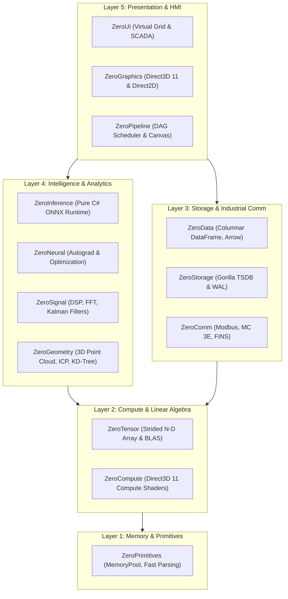

# 🏛️ ZeroPlatform: Architecture & Subsystem Specification

**ZeroPlatform** is a sovereign, enterprise-grade software ecosystem engineered in 100% pure C# for industrial automation, computer vision, digital signal processing (DSP), edge AI, high-speed time-series persistence, and hardware-accelerated HMI/SCADA visual controls.

---

## 1. Multi-Repository Satellite Topology

ZeroPlatform employs a decentralized **Satellite Architecture** where each subsystem is an autonomous repository with independent release cycles, decoupled CI/CD, and zero external runtime dependencies:

---

## 2. Layered Subsystems Matrix

| Layer | Subsystem | Target Repository | Architectural Responsibility |
| :--- | :--- | :--- | :--- |
| **Layer 1: Foundation** | **`ZeroPrimitives`** | [`kzxl/ZeroPrimitives`](https://github.com/kzxl/ZeroPrimitives) | Allocation-free byte manipulation, integer/float span parsers, compiled fast object mappers. |
| **Layer 2: Compute** | **`ZeroTensor`** | [`kzxl/ZeroTensor`](https://github.com/kzxl/ZeroTensor) | Multi-dimensional memory strides, zero-copy slicing, matrix multiplications, SVD/QR decomposition. |
| | **`ZeroCompute`** | [`kzxl/ZeroCompute`](https://github.com/kzxl/ZeroCompute) | Direct3D 11 GPGPU compute dispatcher via COM VTable interop, CPU SIMD Vector256 fallback. |
| **Layer 3: Data & Comm** | **`ZeroData`** | [`kzxl/ZeroData`](https://github.com/kzxl/ZeroData) | Columnar data tables, zero-copy Arrow memory serialization, relational hash joins. |
| | **`ZeroStorage`** | [`kzxl/ZeroStorage`](https://github.com/kzxl/ZeroStorage) | Gorilla Delta-of-Delta + XOR floating-point time-series engine, write-ahead logging (WAL). |
| | **`ZeroComm`** | [`kzxl/ZeroComm`](https://github.com/kzxl/ZeroComm) | Asynchronous industrial master drivers (Modbus TCP/RTU, Mitsubishi MC Protocol 3E, Omron FINS). |
| **Layer 4: Intelligence** | **`ZeroInference`** | [`kzxl/ZeroInference`](https://github.com/kzxl/ZeroInference) | Pure C# ONNX binary model parser, graph evaluation engine, Int8 quantization, Vision NMS. |
| | **`ZeroNeural`** | [`kzxl/ZeroNeural`](https://github.com/kzxl/ZeroNeural) | Reverse-mode automatic differentiation (Autograd), deep learning layers, AdamW optimizer. |
| | **`ZeroSignal`** | [`kzxl/ZeroSignal`](https://github.com/kzxl/ZeroSignal) | In-place radix-2 FFT, STFT spectrograms, zero-phase Butterworth filter, Extended Kalman Filter. |
| | **`ZeroGeometry`** | [`kzxl/ZeroGeometry`](https://github.com/kzxl/ZeroGeometry) | 3D Iterative Closest Point (ICP), KdTree3D, 2D polygon Boolean clipping, Delaunay triangulation. |
| **Layer 5: Presentation** | **`ZeroGraphics`** | [`kzxl/ZeroGraphics`](https://github.com/kzxl/ZeroGraphics) | Direct3D 11 GPU visual canvas, 60 FPS Direct2D waveform oscilloscope, CV algorithms. |
| | **`ZeroUI`** | [`kzxl/ZeroUI`](https://github.com/kzxl/ZeroUI) | 10M+ rows virtual grid, dark theme system (`#12151C`), hardware-accelerated HMI controls. |
| | **`ZeroPipeline`** | [`kzxl/ZeroPipeline`](https://github.com/kzxl/ZeroPipeline) | Kahn-sorted DAG inspection pipeline, JSON recipes, interactive graphical node graph canvas. |

---

## 3. Related Documentation

- For the exhaustive repository-by-repository technical catalog and test suite breakdown, see **[ZERO_PLATFORM_ECOSYSTEM.md](../ZERO_PLATFORM_ECOSYSTEM.md)**.
- For architectural proposals and roadmap expansions, see **[ZERO_PLATFORM_EXPANSION_PROPOSALS.md](../ZERO_PLATFORM_EXPANSION_PROPOSALS.md)**.
