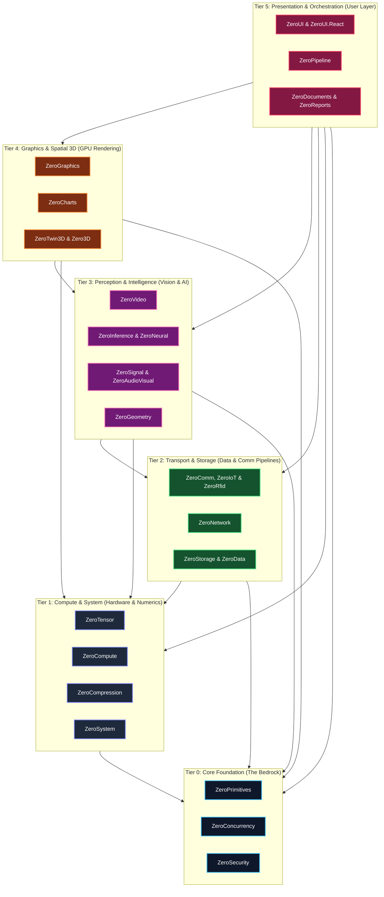

# 🏛️ ZeroPlatform: Architecture & Subsystem Specification

**ZeroPlatform** is a sovereign, enterprise-grade software ecosystem engineered in 100% pure C# for industrial automation, computer vision, digital signal processing (DSP), edge AI, high-speed time-series persistence, and hardware-accelerated HMI/SCADA visual controls.

---

## 1. Multi-Repository Satellite Topology

ZeroPlatform employs a decentralized **Satellite Architecture** where each subsystem is an autonomous repository with independent release cycles, decoupled CI/CD, and zero external runtime dependencies.

All 27 subsystems adhere to the **6-Tier Strict Directed Acyclic Graph (DAG) Taxonomy** (defined in [Tier Taxonomy Specification](tier-taxonomy-specification.md)):

---

## 2. Standardized 6-Tier Subsystems Matrix

| Layer | Subsystem | Repository | Architectural Responsibility |
| :--- | :--- | :--- | :--- |
| **Tier 0: Core Foundation** | **`ZeroPrimitives`** | [`kzxl/ZeroPrimitives`](https://github.com/kzxl/ZeroPrimitives) | Allocation-free byte manipulation, integer/float span parsers, hardware CRC32C, compiled fast object mappers. |
| *(The Bedrock)* | **`ZeroConcurrency`** | [`kzxl/ZeroConcurrency`](https://github.com/kzxl/ZeroConcurrency) | Pure C# lock-free SPSC/MPMC ring buffers, pooled 0-alloc `ValueTask` sources (`ZeroPromise`), CSP channels, execution-context bypass. |
| *(0 Dependencies)* | **`ZeroSecurity`** | [`kzxl/ZeroSecurity`](https://github.com/kzxl/ZeroSecurity) | Pure C# cryptographic suite: BLAKE3, FastSha256, HMAC, HKDF, PBKDF2, ChaCha20/Poly1305, X25519 ECDH. |
| **Tier 1: Compute & System** | **`ZeroSystem`** | [`kzxl/ZeroSystem`](https://github.com/kzxl/ZeroSystem) | Sovereign Windows native subsystem, CPU/GPU/RAM hardware telemetry, and OS diagnostics. |
| *(Hardware & Numerics)* | **`ZeroCompression`** | [`kzxl/ZeroCompression`](https://github.com/kzxl/ZeroCompression) | Streaming multi-codec compression (Zstandard, LZMA, Brotli, Gorilla float TSDB codec), sub-ms heuristic classifier, AES-256-GCM. |
| | **`ZeroTensor`** | [`kzxl/ZeroTensor`](https://github.com/kzxl/ZeroTensor) | Multi-dimensional memory strides, zero-copy slicing, Level-3 BLAS (GEMM), SVD/QR/Cholesky matrix decompositions. |
| | **`ZeroCompute`** | [`kzxl/ZeroCompute`](https://github.com/kzxl/ZeroCompute) | Direct3D 11 GPGPU compute dispatcher via COM VTable interop, CPU SIMD Vector256 fallback kernels. |
| **Tier 2: Transport & Storage** | **`ZeroNetwork`** | [`kzxl/ZeroNetwork`](https://github.com/kzxl/ZeroNetwork) | High-performance network infrastructure, IP/CIDR math, IEEE OUI filtering, ARP table, embedded micro-HTTP server. |
| *(Data & Comm Pipelines)* | **`ZeroComm`** | [`kzxl/ZeroComm`](https://github.com/kzxl/ZeroComm) | Asynchronous industrial master drivers (Modbus TCP/RTU, Siemens S7, Mitsubishi MC 3E, Omron FINS). |
| | **`ZeroIoT`** | [`kzxl/ZeroIoT`](https://github.com/kzxl/ZeroIoT) | Industrial IoT edge connectors, MQTT client, OPC UA client and sensor telemetry bridge. |
| | **`ZeroRfid`** | [`kzxl/ZeroRfid`](https://github.com/kzxl/ZeroRfid) | EPC Gen2 / ISO 18000-6C RFID reader suite, sliding-window anti-collision deduplication & hardware simulator. |
| | **`ZeroStorage`** | [`kzxl/ZeroStorage`](https://github.com/kzxl/ZeroStorage) | Gorilla Delta-of-Delta + XOR floating-point time-series engine, write-ahead logging (WAL), memory-mapped files. |
| | **`ZeroData`** | [`kzxl/ZeroData`](https://github.com/kzxl/ZeroData) | Columnar data tables, zero-copy Arrow memory serialization, relational hash joins (Inner/Left/Right/Outer). |
| **Tier 3: Perception & AI** | **`ZeroSignal`** | [`kzxl/ZeroSignal`](https://github.com/kzxl/ZeroSignal) | In-place radix-2 FFT, STFT spectrograms, zero-phase Butterworth filter, Extended Kalman Filter (EKF), VAD. |
| *(Perception & Intelligence)* | **`ZeroGeometry`** | [`kzxl/ZeroGeometry`](https://github.com/kzxl/ZeroGeometry) | 3D Iterative Closest Point (ICP), KdTree3D/RTree2D, polygon Boolean clipping, Delaunay triangulation. |
| | **`ZeroVideo`** | [`kzxl/ZeroVideo`](https://github.com/kzxl/ZeroVideo) | Industrial Motion JPEG client, RTSP 1.0 transport, RFC 3550 RTP, H.264 NALU/SPS Exp-Golomb, zero-LOH `VideoFramePool`. |
| | **`ZeroAudioVisual`** | [`kzxl/ZeroAudioVisual`](https://github.com/kzxl/ZeroAudioVisual) | Acoustic predictive maintenance, multi-channel microphone array beamforming & defect localization. |
| | **`ZeroInference`** | [`kzxl/ZeroInference`](https://github.com/kzxl/ZeroInference) | Polymorphic `IInferenceSession`, ONNX parser, CPU & OnnxRuntime GPU providers, YOLOv8/v11 anchor-free decoders. |
| | **`ZeroNeural`** | [`kzxl/ZeroNeural`](https://github.com/kzxl/ZeroNeural) | Reverse-mode automatic differentiation (Autograd), deep learning layers, AdamW/SGD optimizer. |
| **Tier 4: Graphics & Spatial 3D** | **`ZeroGraphics`** | [`kzxl/ZeroGraphics`](https://github.com/kzxl/ZeroGraphics) | Render Hardware Interface (RHI - Null & D3D11) with explicit barriers & timeline fences, COM VTable D3D11/D2D, COM VTable graphics interception (`ComVTableHook`), Zero-LOH NCC & Gaussian blur, AVX2 SIMD filters, Async Staging Ring Buffer, Barcode HRI suite. |
| *(GPU Rendering)* | **`ZeroCharts`** | [`kzxl/ZeroCharts`](https://github.com/kzxl/ZeroCharts) | Direct2D GPU high-density telemetry strip charts, dynamic multi-axis graphs. |
| | **`ZeroTwin3D`** | [`kzxl/ZeroTwin3D`](https://github.com/kzxl/ZeroTwin3D) | Pure C# 3D digital twin spatial scene graph, Wavefront OBJ & glTF 2.0 / GLB 3D model loaders, D3D11 renderer. |
| | **`Zero3D`** | [`kzxl/Zero3D`](https://github.com/kzxl/Zero3D) | General-purpose 3D mathematics, camera matrices, lighting models, and geometry mesh rendering. |
| **Tier 5: Presentation & Apps** | **`ZeroDocuments`** | [`kzxl/ZeroDocuments`](https://github.com/kzxl/ZeroDocuments) | Pure C# zero-dependency OpenXML Excel (.xlsx) reader/writer and RFC 4180 CSV engine. |
| *(User Layer & Reporting)* | **`ZeroReports`** | [`kzxl/ZeroReports`](https://github.com/kzxl/ZeroReports) | Pure C# high-speed PDF & industrial thermal barcode label rendering without GDI+ (ZPL/TSPL). |
| | **`ZeroPipeline`** | [`kzxl/ZeroPipeline`](https://github.com/kzxl/ZeroPipeline) | Kahn-sorted DAG inspection pipeline, JSON recipes, interactive graphical node graph canvas. |
| | **`ZeroUI`** | [`kzxl/ZeroUI`](https://github.com/kzxl/ZeroUI) | 10M+ rows virtual grid, single-HWND D3DCanvas, 40+ SCADA controls, Media & Creative Suite, dark theme. |
| | **`ZeroUI.React`** | [`kzxl/ZeroUI.React`](https://github.com/kzxl/ZeroUI.React) | Enterprise & Industrial React component suite for SCADA, connected button clusters, universal theme token synchronization with Desktop. |

---

## 3. Architectural Invariants

1. **Downstream-Only Flow ($L_N \rightarrow L_{<N}$)**:
   * A project in Tier $N$ can only reference projects in Tier $0 \le i < N$.
   * Circular dependencies are strictly forbidden and enforced by CI/CD linters.
2. **The Zero-Dependency Bedrock (Tier 0)**:
   * `ZeroPrimitives`, `ZeroConcurrency`, and `ZeroSecurity` must never take any dependency on other ZeroPlatform libraries.
3. **Hybrid Linking**:
   * Projects reference local source projects via `<ProjectReference>` when available in the unified orchestrator, and fallback to `<PackageReference>` when built in isolated satellite CI pipelines.

---

## 4. Related Specifications

- **[Tier Taxonomy & Architectural Governance Specification](tier-taxonomy-specification.md)**: Exhaustive rules, MSBuild metadata, and PR guidelines.
- **[Subsystem Catalog](../ZERO_PLATFORM_ECOSYSTEM.md)**: Full codebase metrics, test suite statistics, and multi-targeting matrix.
