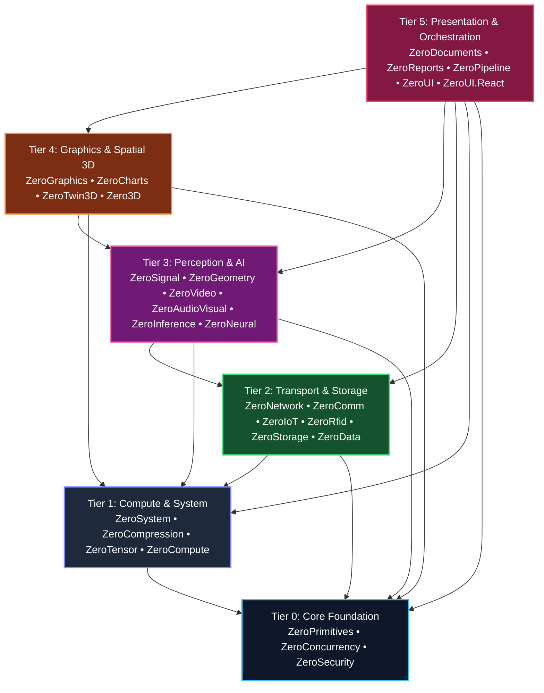

# 🛰️ ZeroPlatform: Autonomous Satellites Architecture & Integration Guide

> **Specification**: SPEC-ARCH-002  
> **Related Documents**: [Tier Taxonomy Specification (SPEC-ARCH-001)](tier-taxonomy-specification.md) • [Subsystem Catalog & Git Standards (GOV-REPO-001)](../governance/subsystem-catalog-and-git-descriptions.md)

---

## 1. The Autonomous Satellite Philosophy

ZeroPlatform does not follow a monolithic code repository model. Instead, it is architected as an **Ecosystem of Sovereign Autonomous Satellites**:

1. **Sovereign Repositories**:
   Each of the 28 subsystems resides in its own dedicated Git repository under `https://github.com/kzxl/<SubsystemName>.git` with its own issue tracker, CI/CD pipeline, and semantic versioning tag sequence.
2. **Dual Identity**:
   - **Standalone Library**: Can be cloned, compiled, and published to NuGet.org independently without downloading the rest of the ecosystem.
   - **Unified Solution Member**: When cloned into the ZeroPlatform workspace, all subsystems integrate into `ZeroPlatform.slnx` organized into numbered tier folders.
3. **Pure C# Sovereignty**:
   Zero third-party runtime dependencies (no native C++ runtimes, no Python, no unmanaged bindings). Every satellite runs deterministically on standard .NET runtimes.

---

## 2. Satellite Classification in the 6-Tier DAG

Every satellite is strictly assigned to one of six architectural tiers according to its foundational level:



---

## 3. Satellite Inter-Dependency Contract (Hybrid Linking)

To maintain autonomy while supporting developer-friendly project references in the root workspace, satellites utilize **Conditional Hybrid Linking**:

```xml
<!-- Example: ZeroVideo referencing Tier 0 ZeroConcurrency -->
<ItemGroup Condition="Exists('..\..\ZeroConcurrency\src\ZeroConcurrency\ZeroConcurrency.csproj')">
  <ProjectReference Include="..\..\ZeroConcurrency\src\ZeroConcurrency\ZeroConcurrency.csproj" />
</ItemGroup>

<ItemGroup Condition="!Exists('..\..\ZeroConcurrency\src\ZeroConcurrency\ZeroConcurrency.csproj')">
  <PackageReference Include="ZeroConcurrency" Version="1.0.0" />
</ItemGroup>
```

- **In Workspace (`ZeroPlatform.slnx`)**: The local project file is discovered, enabling seamless cross-library debugging, refactoring, and instant compilation across all 28 repositories.
- **In Isolated CI/CD (GitHub Actions)**: The project falls back to published NuGet packages, ensuring completely independent builds without cloning the entire monorepo.

---

## 4. Satellite Governance Invariants

1. **Downstream Rule**: Subsystems in Tier $N$ must only consume Tier $< N$. Upward or cyclic dependencies are strictly prohibited.
2. **Tier 0 Independence**: Core foundation libraries (`ZeroPrimitives`, `ZeroConcurrency`, `ZeroSecurity`) must have **0 external and 0 internal platform dependencies**.
3. **Pure BCL Guarantee**: Unmanaged binaries or wrappers are forbidden on hot execution loops.
4. **Multi-Targeting**: Core libraries maintain dual-targeting (`net8.0`, `net462`, `netstandard2.0`) to service both modern edge nodes and legacy enterprise SCADA installations.
