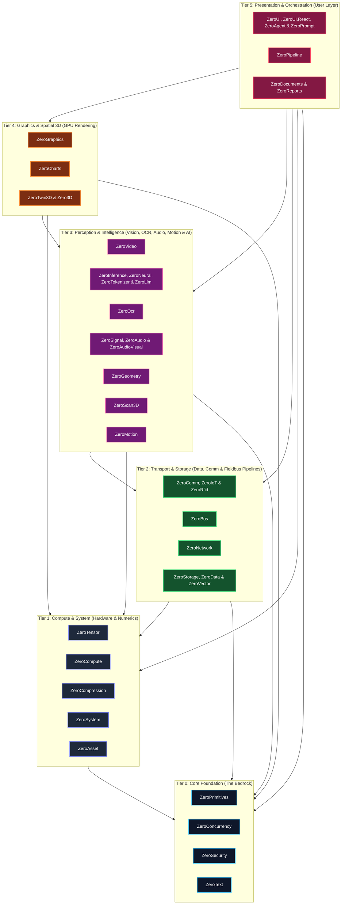
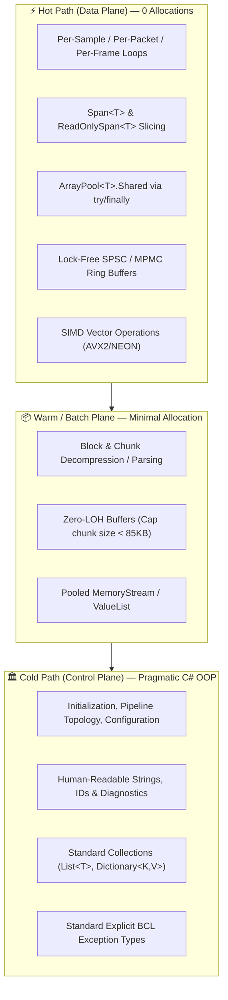

# 🏛️ ZeroPlatform: Tier Taxonomy & Architectural Governance Specification

| Document ID | Version | Status | Effective Date | Target Audience |
| :--- | :---: | :---: | :---: | :--- |
| **SPEC-ARCH-001** | `v2.0.0` | **Active / Approved** | 2026-09-22 | Core Architects, Subsystem Maintainers, AI Coding Agents |

---

## 1. Executive Summary & Architectural Motivation

ZeroPlatform is engineered as a sovereign, pure C# industrial software ecosystem operating across 39 autonomous satellite repositories. 

Historically, each satellite maintained a strictly isolated "Zero Runtime Dependencies" philosophy. While this preserved autonomy, it resulted in **accidental duplication of foundation primitives** (e.g., custom ring buffers in `ZeroComm`, custom CRCs in `ZeroStorage`, custom unmanaged queues in `ZeroGraphics`).

This specification establishes the **ZeroPlatform 6-Tier Strict Directed Acyclic Graph (DAG) Taxonomy**. It establishes formal boundaries, dependency invariants, metadata tagging conventions, and integration rules governing all 39 subsystems.

---

## 2. The 6-Tier Hierarchy Overview


```mermaid
graph TD
    classDef l0 fill:#0f172a,stroke:#38bdf8,stroke-width:2px,color:#fff;
    classDef l1 fill:#1e293b,stroke:#818cf8,stroke-width:2px,color:#fff;
    classDef l2 fill:#14532d,stroke:#4ade80,stroke-width:2px,color:#fff;
    classDef l3 fill:#701a75,stroke:#f472b6,stroke-width:2px,color:#fff;
    classDef l4 fill:#7c2d12,stroke:#fb923c,stroke-width:2px,color:#fff;
    classDef l5 fill:#831843,stroke:#f43f5e,stroke-width:2px,color:#fff;

    subgraph L5 ["Tier 5: Presentation & Orchestration (User Layer)"]
        UI["ZeroUI, ZeroUI.React, ZeroAgent & ZeroPrompt"]:::l5
        Pipe["ZeroPipeline"]:::l5
        Docs["ZeroDocuments & ZeroReports"]:::l5
    end

    subgraph L4 ["Tier 4: Graphics & Spatial 3D (GPU Rendering)"]
        Gfx["ZeroGraphics"]:::l4
        Charts["ZeroCharts"]:::l4
        Twin["ZeroTwin3D & Zero3D"]:::l4
    end

    subgraph L3 ["Tier 3: Perception & Intelligence (Vision, OCR, Audio, Motion & AI)"]
        Video["ZeroVideo"]:::l3
        Infer["ZeroInference, ZeroNeural, ZeroTokenizer & ZeroLlm"]:::l3
        Ocr["ZeroOcr"]:::l3
        Sig["ZeroSignal, ZeroAudio & ZeroAudioVisual"]:::l3
        Geom["ZeroGeometry"]:::l3
        Scan["ZeroScan3D"]:::l3
        Mot["ZeroMotion"]:::l3
    end

    subgraph L2 ["Tier 2: Transport & Storage (Data, Comm & Fieldbus Pipelines)"]
        Comm["ZeroComm, ZeroIoT & ZeroRfid"]:::l2
        Bus["ZeroBus"]:::l2
        Net["ZeroNetwork"]:::l2
        Store["ZeroStorage, ZeroData & ZeroVector"]:::l2
    end

    subgraph L1 ["Tier 1: Compute & System (Hardware & Numerics)"]
        Tensor["ZeroTensor"]:::l1
        Comp["ZeroCompute"]:::l1
        Compres["ZeroCompression"]:::l1
        Sys["ZeroSystem"]:::l1
        Asset["ZeroAsset"]:::l1
    end

    subgraph L0 ["Tier 0: Core Foundation (The Bedrock)"]
        Prim["ZeroPrimitives"]:::l0
        Conc["ZeroConcurrency"]:::l0
        Sec["ZeroSecurity"]:::l0
        Txt["ZeroText"]:::l0
    end

    L5 --> L4 & L3 & L2 & L1 & L0
    L4 --> L3 & L1 & L0
    L3 --> L2 & L1 & L0
    L2 --> L1 & L0
    L1 --> L0
```

---

## 3. Detailed Tier Definitions & Subsystems

### Tier 0: Core Foundation (The Bedrock)
* **Architectural Invariant**: **Zero Platform Dependencies ($L_0 \rightarrow \emptyset$)**. Tier 0 libraries MUST NEVER reference any other ZeroPlatform project or package.
* **Responsibilities**: Microsecond/nanosecond primitive data structures, lock-free concurrency, memory management, cryptographic algorithms, text algorithms.

| Subsystem | Primary Capabilities |
| :--- | :--- |
| **`ZeroPrimitives`** | Zero-allocation span parsers, pointer arithmetic, `FastBinary`, `FastConvert`, `ByteRingBuffer`, compiled object mapping. |
| **`ZeroConcurrency`** | Lock-free SPSC (`ZeroRingBuffer`) & MPMC (`ZeroMpmcRingBuffer`), CSP channels (`ZeroChannel`), pooled `ValueTask` sources (`ZeroPromise`), dedicated pinned threads (`ZeroDedicatedWorker`), ExecutionContext bypass. |
| **`ZeroSecurity`** | Cryptographic primitives: BLAKE3, FastSha256, HMAC, HKDF, PBKDF2, ChaCha20/Poly1305, X25519 ECDH, Cuckoo/Bloom Filters. |
| **`ZeroText`** | Pure C# zero-allocation text algorithms, fast regex, KMP substring search, and Vietnamese diacritics removal normalizer. |

---

### Tier 1: Compute & System (Hardware & Numerics)
* **Architectural Invariant**: Can only depend on **Tier 0 ($L_1 \rightarrow L_0$)**.
* **Responsibilities**: OS telemetry, hardware diagnostics, multi-codec stream compression, N-dimensional matrix mathematics, digital asset management, and GPU compute dispatching.

| Subsystem | Primary Capabilities |
| :--- | :--- |
| **`ZeroSystem`** | Sovereign Windows native OS subsystem, CPU/GPU/RAM/Disk hardware telemetry, process diagnostics. |
| **`ZeroCompression`** | Streaming multi-codec compression (Zstandard, LZMA, Brotli, Gorilla float TSDB codec), heuristic data classifier, AES-256-GCM AEAD, TAR/ZIP containers. |
| **`ZeroTensor`** | N-D strided memory layout, zero-copy tensor slicing, Level-3 BLAS (GEMM), BFloat16/INT4 quantization, SVD/QR/Cholesky matrix decompositions. |
| **`ZeroCompute`** | Direct3D 11 Compute Shader dispatcher via COM VTable, UAV buffer/texture binding, 5-level CPU parallel compute runtime with NUMA/cache-aware tiling. |
| **`ZeroAsset`** | Digital asset management (DAM), zero-byte variant branching (`#vc<n>`), hierarchical contiguous sorting, curation & cache keys. |

---

### Tier 2: Transport & Storage (Data Pipelines & Industrial Protocols)
* **Architectural Invariant**: Can only depend on **Tier 0 and Tier 1 ($L_2 \rightarrow L_0, L_1$)**.
* **Responsibilities**: In-memory columnar data representations, embedded time-series storage, network infrastructure, vector similarity storage, and fieldbus communications.

| Subsystem | Primary Capabilities |
| :--- | :--- |
| **`ZeroNetwork`** | High-speed network infrastructure, CIDR IP math, ARP table scanning, IEEE OUI identification, embedded micro-HTTP server. |
| **`ZeroComm`** | Asynchronous industrial master drivers (Modbus TCP/RTU, Siemens S7, Mitsubishi MC 3E, Omron FINS), circular DMA ingestion. |
| **`ZeroIoT`** | Industrial IoT edge connectors, MQTT v3.1.1/v5.0 client with Exactly-Once QoS 2, OPC UA client with X.509 mTLS encryption and telemetry sensor bridge. |
| **`ZeroRfid`** | EPC Gen2 / ISO 18000-6C RFID reader adapters, sliding-window anti-collision deduplication pipeline, physical hardware simulator. |
| **`ZeroStorage`** | Embedded TSDB, Facebook Gorilla Delta-of-Delta + XOR compression, MMF zero-copy persistence, Write-Ahead Log (WAL). |
| **`ZeroData`** | Columnar DataFrame, SIMD relational hash joins, Dynamic NL-to-SQL builder & schema metadata, compiled SQL expressions, Arrow IPC, Roslyn-less CodeGen. |
| **`ZeroVector`** | High-throughput embedded Vector Database & SIMD similarity metric engine, AVX2/FMA metrics, Flat contiguous index & HNSW graph index. |
| **`ZeroBus`** | Real-time motion fieldbus suite: CAN 2.0A/B & CAN FD, CANopen CiA 301 (NMT, SDO, PDO) & CiA 402 Servo Drive Profile (PPM, PVM, CSP), EtherCAT Master (ESM state machine, CoE mailbox, cyclic LRW exchange). |

---

### Tier 3: Perception & Intelligence (Signal, Vision, OCR, Audio, Motion & AI)
* **Architectural Invariant**: Can depend on **Tier 0, Tier 1, and Tier 2 ($L_3 \rightarrow L_0, L_1, L_2$)**.
* **Responsibilities**: Signal processing, point clouds, robotics kinematics, trajectory planning, URDF models, live video ingestion/streaming, acoustic analytics, neural execution graphs, OCR inspection, tokenizers, SLMs, and deep learning inference.

| Subsystem | Primary Capabilities |
| :--- | :--- |
| **`ZeroSignal`** | In-place radix-2 Cooley-Tukey FFT, zero-phase Butterworth `FiltFilt`, Extended Kalman Filter (EKF), DWT wavelets, and Levenberg-Marquardt non-linear least squares optimization. |
| **`ZeroAudio`** | Pure C# audio DSP & streaming engine, WAV/RIFF codec, lock-free SPSC `AudioRingBuffer`, ArrayPool-backed `AudioBuffer`, cubic Hermite resampling, STFT spectrograms, Voice Activity Detection (VAD). |
| **`ZeroGeometry`** | 3D ICP rigid cloud alignment, KdTree3D/RTree2D spatial queries, surface normal estimation, Sutherland-Hodgman clipping, Delaunay triangulation. |
| **`ZeroMotion`** | Robotics & motion control: Forward/Inverse Kinematics (6-Axis, SCARA, Cartesian), Geometric Jacobians, CCD & Analytical closed-form IK, 7-phase Jerk-limited S-curve trajectory generation, pure C# ROS URDF parser. |
| **`ZeroScan3D`** | 3D Spatial scanning & Visual SLAM: Pinhole camera RGB-D unprojection, 6-DOF visual odometry tracking, incremental sparse voxel grid mapping, continuous TSDF volume integration, Marching Cubes isosurface extraction (OBJ/PLY). |
| **`ZeroVideo`** | Industrial Motion JPEG client, RTSP 1.0 session transport, RFC 3550 RTP demuxing, H.264 NALU scanner & Exp-Golomb SPS parser, zero-LOH `VideoFramePool`, PTS playback. |
| **`ZeroAudioVisual`** | Acoustic predictive maintenance & multi-channel microphone array beamforming defect localization. |
| **`ZeroInference`** | Polymorphic `IInferenceSession`, pure C# ONNX binary model parser, CPU execution graph & OnnxRuntime GPU providers, YOLOv8/v11 anchor-free decoders (detect, pose, seg). |
| **`ZeroNeural`** | PyTorch-like reverse-mode automatic differentiation (Autograd) DAG tape, neural layers (`Linear`, `Sequential`, `Conv2D`, `Dropout`), AdamW/SGD. |
| **`ZeroOcr`** | Pure C# zero-allocation OCR abstractions, AVX2 SIMD preprocessor (ITU-R BT.601, binarization), dot-matrix morphology, HPP projection deskewing, parallel multi-ROI inspection, and native Windows WinRT OCR engine. |
| **`ZeroTokenizer`** | High-throughput Pure C# BPE & Tiktoken tokenizer (`cl100k_base`, `o200k_base`, LLaMA-3), UTF-8 byte-level fallback, and Priority-Knapsack Token Budgeter. |
| **`ZeroLlm`** | Pure C# Small Language Model runtime, GGUF v2/v3 binary parser, Paged KV-Cache allocator, Transformer decoder (RMSNorm, RoPE, SwiGLU, GQA), and token sampling engine. |

---

### Tier 4: Graphics & Spatial 3D (GPU Rendering)
* **Architectural Invariant**: Can depend on **Tier 0, Tier 1, Tier 2, and Tier 3 ($L_4 \rightarrow L_0, L_1, L_2, L_3$)**.
* **Responsibilities**: Low-level Render Hardware Interface (RHI), real-time telemetry charts, spatial digital twin rendering, and 3D scenes.

| Subsystem | Primary Capabilities |
| :--- | :--- |
| **`ZeroGraphics`** | Render Hardware Interface (RHI - Null, D3D11, and cross-platform Vulkan 1.0+ `VulkanRhiDevice`) with explicit barriers & timeline fences, COM VTable D3D11/D2D, COM VTable graphics interception (`ComVTableHook`), Zero-LOH NCC & Gaussian blur, AVX2 SIMD filters, Async Staging Ring Buffer, Barcode HRI suite. |
| **`ZeroCharts`** | Direct2D GPU high-density telemetry strip charts, dynamic multi-axis graphs, 60–144Hz waveform visualizers. |
| **`ZeroTwin3D`** | Pure C# 3D digital twin spatial scene graph, Wavefront OBJ & glTF 2.0 / GLB 3D loaders, Direct3D 11 rendering pipeline, orbit/fly camera navigation. |
| **`Zero3D`** | General-purpose 3D mathematics, camera matrices, lighting models, and geometry mesh rendering. |

---

### Tier 5: Presentation, Documents & Orchestration (User Layer)
* **Architectural Invariant**: Highest layer. Can consume all underlying layers ($L_5 \rightarrow L_{0..4}$).
* **Responsibilities**: High-density desktop & web HMI/SCADA controls, interactive node graphs, industrial reporting, autonomous AI agents, grammar prompt engines, and document generation.

| Subsystem | Primary Capabilities |
| :--- | :--- |
| **`ZeroDocuments`** | Pure C# zero-dependency OpenXML Excel (.xlsx) reader/writer and RFC 4180 CSV engine. |
| **`ZeroReports`** | Pure C# high-speed PDF & industrial thermal barcode label rendering without GDI+ (ZPL/TSPL/ESC-POS emulation). |
| **`ZeroPipeline`** | Kahn-sorted Directed Acyclic Graph (DAG) inspection pipeline, Sub-DAG macro nodes, declarative JSON recipes, and interactive visual node canvas. |
| **`ZeroUI`** | ISA-101 Industrial HMI Design System, `ZAiChatBox` AI copilot streaming chat (WPF & WinForms), `ZOcrViewer` & `ZDocumentDeskew` inspection, 10M+ rows virtual grid, single-HWND D3DCanvas, 40+ industrial SCADA controls, Media & Creative Editors Suite. |
| **`ZeroUI.React`** | Enterprise & Industrial React component suite for SCADA, connected button clusters, universal theme token synchronization with Desktop. |
| **`ZeroAgent`** | Pure C# Cognitive ReAct execution loop (Thought-Action-Observation), Zero-reflection tool calling registry, episodic memory recall backed by ZeroVector, DynamicDatabaseQueryTool NL-to-SQL engine, and CSP multi-agent swarm. |
| **`ZeroPrompt`** | Pure C# prompt templating, Pushdown Automaton (PDA) JSON Grammar state machine, grammar-constrained logit masking, and dynamic few-shot exemplar selector. |

---

## 4. Architectural Rules & Governance

### Rule 1: The Downstream Invariant (Strict DAG)
A subsystem in Tier $N$ may only reference subsystems in Tier $< N$.
* **Violation**: If `ZeroComm` (Tier 2) attempts to reference `ZeroGraphics` (Tier 4) or `ZeroVideo` (Tier 3), it will be rejected at compile-time.

### Rule 2: The Core Independence Principle
Tier 0 (`ZeroPrimitives`, `ZeroConcurrency`, `ZeroSecurity`) must have **0 external and 0 internal platform dependencies**. They must remain standalone compilable with standard .NET BCL only.

### Rule 3: Autonomous Satellite Hybrid Linking
To allow each repository to be cloned, developed, and published completely independently while benefiting from full cross-project navigation in the workspace orchestrator:

```xml
<ItemGroup Condition="Exists('..\..\ZeroConcurrency\src\ZeroConcurrency\ZeroConcurrency.csproj')">
  <ProjectReference Include="..\..\ZeroConcurrency\src\ZeroConcurrency\ZeroConcurrency.csproj" />
</ItemGroup>

<ItemGroup Condition="!Exists('..\..\ZeroConcurrency\src\ZeroConcurrency\ZeroConcurrency.csproj')">
  <PackageReference Include="ZeroConcurrency" Version="1.0.0" />
</ItemGroup>
```

---

## 5. Metadata Tagging & Visual Indicators

### MSBuild Properties
Each subsystem defines its tier level in `Directory.Build.props`:
```xml
<PropertyGroup>
  <ZeroTier>0</ZeroTier>
  <ZeroTierName>CoreFoundation</ZeroTierName>
  <PackageTags>$(PackageTags);zeroplatform;tier-0;foundation</PackageTags>
</PropertyGroup>
```

### Visual Badges in README.md
Each repository includes the standardized Tier badge in its header:
```markdown
[-0284c7.svg)]()
```

| Tier | Hex Color | Badge Label |
| :---: | :---: | :--- |
| **0** | `#0284c7` | `Tier 0 (Core Foundation)` |
| **1** | `#4f46e5` | `Tier 1 (Compute & System)` |
| **2** | `#059669` | `Tier 2 (Transport & Storage)` |
| **3** | `#7c3aed` | `Tier 3 (Perception & AI)` |
| **4** | `#ea580c` | `Tier 4 (Graphics & Spatial 3D)` |
| **5** | `#e11d48` | `Tier 5 (Presentation & Apps)` |

---

## 6. Memory Allocation Doctrine: Minimal Allocation & Maximum Pragmatic Efficiency

ZeroPlatform rejects dogmatic, extreme "Zero-Allocation-Everywhere" gymnastics that sacrifice code clarity and maintainability for negligible gain in cold paths. Instead, all 27+ subsystems adhere strictly to the **Minimal Allocation & Maximum Pragmatic Efficiency Standard**:


```mermaid
flowchart TD
    subgraph DataPlane ["⚡ Hot Path (Data Plane) — 0 Allocations"]
        H1["Per-Sample / Per-Packet / Per-Frame Loops"]
        H2["Span&lt;T&gt; & ReadOnlySpan&lt;T&gt; Slicing"]
        H3["ArrayPool&lt;T&gt;.Shared via try/finally"]
        H4["Lock-Free SPSC / MPMC Ring Buffers"]
        H5["SIMD Vector Operations (AVX2/NEON)"]
    end

    subgraph BatchPlane ["📦 Warm / Batch Plane — Minimal Allocation"]
        W1["Block & Chunk Decompression / Parsing"]
        W2["Zero-LOH Buffers (Cap chunk size &lt; 85KB)"]
        W3["Pooled MemoryStream / ValueList"]
    end

    subgraph ControlPlane ["🏛️ Cold Path (Control Plane) — Pragmatic C# OOP"]
        C1["Initialization, Pipeline Topology, Configuration"]
        C2["Human-Readable Strings, IDs & Diagnostics"]
        C3["Standard Collections (List&lt;T&gt;, Dictionary&lt;K,V&gt;)"]
        C4["Standard Explicit BCL Exception Types"]
    end

    DataPlane --> BatchPlane --> ControlPlane
```

### Governing Rules:
1. **Hot Path Strictness**: Any code executing continuously on telemetry streams, audio/video frames, socket packets, or inner DSP filters MUST NOT allocate on the managed heap. Use `Span<T>`, `ReadOnlyMemory<T>`, or rent from `ArrayPool<T>.Shared`.
2. **Warm/Batch Pragmatism**: In block transforms (e.g., zero-phase `FiltFilt`, batch decompression, FFT runs), allocate or rent memory efficiently and return it promptly. Never leak memory into the Large Object Heap (LOH).
3. **Cold Path Usability**: In initialization, dependency wiring, configuration parsing, diagnostic summaries, and user interface event dispatching, write clean, idiomatic, readable Standard C#. Do not replace readable strings and `List<T>` with obscure unsafe pointers or complex fixed buffers unless verified by profiling.
4. **Safety Over Raw Pointers**: Favor safe BCL abstractions (`Span<T>`, `MemoryMarshal`, `Unsafe.Add`) over raw unmanaged pointers (`*`). Reserve raw unmanaged pointers strictly for COM VTable interop (DirectX, Direct2D, WIC) and low-level SIMD intrinsics.

