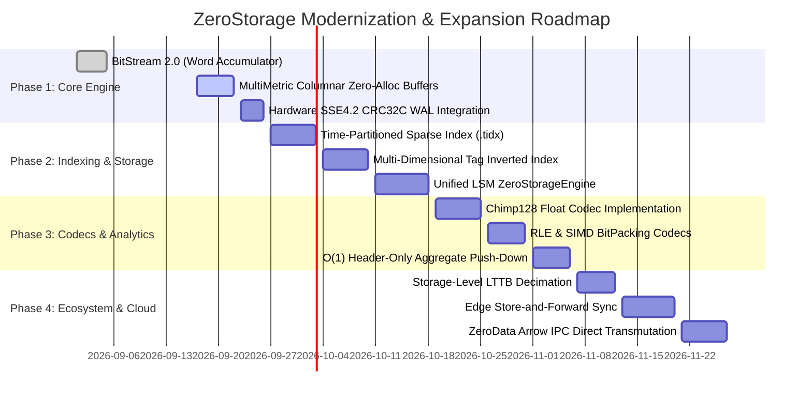

# ZeroStorage: In-Depth Architecture & Expansion Specification

## 1. Executive Summary & Current State Baseline (v1.1.0)

**ZeroStorage** is an embedded, sovereign industrial time-series database (TSDB) and write-ahead log (WAL) engine written in pure C# with **zero external dependencies** for .NET multi-targeting (`netstandard2.0`, `net462`, `net8.0`).

### Current Capabilities (v1.1.0)
- **Gorilla Codecs**: Facebook Gorilla Delta-of-Delta timestamp compression and IEEE 754 XOR floating-point mantissa encoding.
- **Wide-Row Time-Series (`MultiMetricBlock`)**: Multi-variate columnar representation supporting `Float64`, `Int32`, `Int64`, `Boolean`, `Decimal`, and `String`.
- **Memory-Mapped Persistence (`MemoryMappedTimeSeriesLog`)**: Direct kernel-level disk mapping via `MemoryMappedFile` for fast block append.
- **Write-Ahead Log (`WriteAheadLog`)**: Append-only durability log with IEEE 802.3 CRC32 checksums per record.
- **Compaction & Retention**: In-memory block deduplication/compaction (`TimeSeriesCompactor`) and multi-tiered rollup downsampling with TTL expiry (`RetentionPolicyEngine`).

---

## 2. Architectural Bottlenecks & Technical Limitations

| Component | Current Implementation | Technical Bottleneck / Pain Point | Architectural Impact |
| :--- | :--- | :--- | :--- |
| **Query Engine** | Linear scan `Query(metricId, fromTime, toTime)` traversing all block headers. | **$O(N)$ sequential file traversal**. Reading 1M blocks requires decoding and skipping 1M 52-byte headers over MMF. | High query latency on multi-gigabyte files (> 500ms). Unsuitable for real-time SCADA interactive dashboards. |
| **Bit I/O** | `BitStreamWriter` & `BitStreamReader` write/read bit-by-bit via `MemoryStream`. | **Bit-by-bit loop** (`for i = numBits-1 ... WriteBit`). No 64-bit word accumulator, no bulk bit operations. | CPU instruction overhead limits ingest throughput to ~12M pts/s instead of theoretical 50M+ pts/s. |
| **Data Ingestion** | `MultiMetricRow` stores columns as `object?[] Values`. | **Severe boxing/unboxing overhead** for every numerical sample. Creates massive GC Gen0 pressure during high-frequency ingestion. | GC pauses degrade deterministic real-time data collection from high-speed PLCs. |
| **Metadata & Dimensions** | Single `metricId: int` in `TimeSeriesBlock` and `SeriesName: string` in `MultiMetricBlock`. | **No multi-dimensional tag-set indexing**. Industrial telemetry requires arbitrary labels (e.g., `device`, `cell`, `station`, `sensor_type`). | Cannot execute multi-tag filters (e.g., `tag:line="A" AND sensor="temp"`). |
| **Lifecycle Unification** | WAL, MMF Log, Compactor, and Retention Engine are standalone classes. | **No autonomous orchestration**. Developer must manually wire WAL append, block chunking, and compaction schedules. | Complex integration burden on application developers; risk of data corruption if crash occurs between WAL and MMF. |
| **Analytical Query** | Must decompress all points before downsampling or aggregating. | **No metadata push-down**. Ignores precomputed block headers (`Min`, `Max`, `Sum`, `Count`) during query evaluation. | Excessive memory allocation and CPU cycles for simple aggregate queries (e.g., hourly max). |

---

## 3. The 6 Strategic Expansion Pillars

```mermaid
flowchart TD
    subgraph Ingestion ["1. High-Throughput Zero-Alloc Ingest"]
        IoT[ZeroIoT / ZeroComm] --> RingBuf[Lock-Free Columnar RingBuffer]
        RingBuf --> WAL[SSE4.2 Hardware WAL]
        RingBuf --> MemTable[In-Memory Active MemTable]
    end

    subgraph StorageEngine ["2. Tiered LSM Storage Engine"]
        MemTable -->|Flush Chunk| L1[L1: Hot Immutable Segments .zts]
        L1 -->|Tiered Compaction| L2[L2: Cold Compacted Segments]
        L2 -->|Retention & Downsample| L3[L3: Rollup Archive Store]
    end

    subgraph Codecs ["3. Advanced Industrial Codecs"]
        GPlus[Gorilla+ / Chimp128]
        SIMDBP[SIMD BitPacking / FastPFor]
        RLE[RLE + Bitmap Engine]
        Dict[Dictionary String Codec]
    end

    subgraph Indexing ["4. Multi-Dimensional Indexing"]
        TSI[Inverted Tag Index Roaring Bitmap]
        SparseIdx[Time-Partitioned Sparse B+Tree Index]
    end

    subgraph QueryEngine ["5. Analytical & Push-Down Engine"]
        PushDown[O(1) Header Aggregate Push-Down]
        LTTB[Storage-Level LTTB Decimation]
        Bridge[ZeroData DataFrame & Arrow Zero-Copy Bridge]
    end

    StorageEngine -.-> Codecs
    StorageEngine --> Indexing
    Indexing --> QueryEngine
    StorageEngine --> QueryEngine
```

---

### Pillar 1: LSM-Tree Tiered Storage Engine (`ZeroStorageEngine`)

Transform `ZeroStorage` into a fully integrated, self-orchestrating time-series database engine:

1. **MemTable (Head Block)**:
   - In-memory lock-free active chunk buffer using structured columnar unmanaged memory (`NativeMemory` or pooled arrays).
   - Thread-safe single-writer multi-reader (SWMR) design.
2. **Durability via Hardware WAL**:
   - Upgrade `WriteAheadLog` to leverage `ZeroPrimitives` hardware-accelerated CRC32C (SSE4.2 / ARM64 NEON).
   - Group commit / deferred batch fsync support (tuneable durability vs. throughput tradeoff: `Immediate`, `BatchIntervalMs(10)`, `Async`).
3. **Immutable Segment Files (`.zts`)**:
   - Flush MemTable chunks when size reaches threshold (e.g., 64 KB or 10,000 points) into immutable disk segment files.
   - Segment format contains Header, Metadata Block, Compressed Columnar Streams, and Segment Footer with CRC32C and Sparse Index.
4. **Autonomous Background Workers**:
   - `CompactionWorker`: Merges smaller adjacent segments into consolidated L2 segments, eliminating duplicate timestamps.
   - `RetentionWorker`: Automatically evaluates `RetentionRule` schedules, downsamples expired L1/L2 data into L3 rollups, and unlinks purged files.

---

### Pillar 2: Multi-Dimensional Tag Index (TSI - Time Series Index)

Industrial SCADA/IoT requires dynamic labeling rather than rigid integer IDs.

1. **Series Key Representation**:
   - Standardized format: `measurement,tag1=val1,tag2=val2... metric`.
   - 64-bit `SeriesId` computed via 64-bit MurmurHash3 / FastHash.
2. **Inverted Index via Pure C# Roaring Bitmaps**:
   - Inverted mapping: `TagKey:TagValue -> RoaringBitmap(SeriesIds)`.
   - Multi-tag queries: `Tag1=Val1 AND Tag2=Val2` executed via bitwise AND operations over roaring bitmaps in sub-microsecond time.
3. **Time-Partitioned Sparse Index**:
   - Each segment file maintains a sparse index entry for every $N$ blocks:
     $$\text{SparseIndexEntry} = \langle \text{SeriesId}, \text{MinTimestamp}, \text{MaxTimestamp}, \text{FileOffset}, \text{Length} \rangle$$
   - Querying time range $[T_1, T_2]$ uses in-memory binary search $O(\log B)$ to jump directly to target offsets, completely replacing full file scans.

---

### Pillar 3: Advanced Industrial Codecs Suite

Expand beyond classic Gorilla to support domain-optimized codecs:

| Codec | Target Data Type | Characteristics & Compression Efficiency | Comparison vs. Gorilla |
| :--- | :--- | :--- | :--- |
| **Chimp128** (VLDB 2022) | `double`, `float` | Uses trailing zero tracking and variable leading zero buckets. | **20–30% higher compression** than Gorilla; 2.5x faster decompression. |
| **SIMD BitPacking / FastPFor** | `int`, `long`, UInt | Frame-of-Reference (FoR) with vectorized bit packing. | Ideal for monotonic counters (energy kWh, motor revolution counters). Down to **0.5–2 bits/int**. |
| **Run-Length Encoding (RLE) + Bitmap** | `bool`, Discrete Enum | Run length counting for unchanging states. | Ideal for PLC binary status (`RUN`, `ALARM`, `TRIP`). Hundreds of hours of state encoded in **< 100 bytes**. |
| **Dictionary Codec** | `string` | String deduplication table with variable-byte indices. | Optimal for recipe names, shift codes, operator IDs. |

---

### Pillar 4: Zero-Allocation & High-Throughput Pipeline

Eradicate all runtime allocations during both ingestion and decompression:

1. **Columnar Chunk Ingest Buffers**:
   - Replace `MultiMetricRow(long Timestamp, object?[] Values)` with typed columnar spans:
     ```csharp
     public ref struct ColumnarWriteBatch
     {
         public ReadOnlySpan<long> Timestamps;
         public ReadOnlySpan<double> Doubles;
         public ReadOnlySpan<int> Integers;
     }
     ```
2. **BitStream 2.0 (Word-Accumulator)**:
   - Implement `BitWriter64`: Uses a 64-bit `ulong` buffer to accumulate bits. Flushes an entire 8-byte word in a single instruction when filled.
   - Zero-allocation over pre-allocated `Span<byte>` or unmanaged memory.
3. **Streaming Cursor Decompressor**:
   - Implement `TimeSeriesCursor`: Zero-alloc forward-only reader. Points are decoded directly into stack-allocated structs without instantiating `List<TimeSeriesPoint>`.

---

### Pillar 5: Analytical Query Engine & Header Push-Down

1. **$O(1)$ Header-Only Aggregate Push-Down**:
   - For aggregate queries like `SELECT MIN(v), MAX(v), SUM(v), COUNT(v) WHERE t >= T1 AND t <= T2`:
     - If a block is completely enclosed in $[T_1, T_2]$, read precomputed stats directly from block header without decompressing payload!
     - Only boundary blocks (partially overlapping) are decompressed.
     - **Speedup**: $100\times - 1000\times$ faster response times for analytical dashboards.
2. **Storage-Level LTTB Decimation**:
   - Largest-Triangle-Three-Buckets (LTTB) algorithm applied directly inside the storage query pipeline.
   - SCADA chart requesting 2,000 pixels over 10,000,000 raw points receives 2,000 representative points directly from the engine, reducing network and memory transit by 99.98%.
3. **Native `ZeroData` DataFrame Direct Transmutation**:
   - Decompress TSDB columns directly into `ZeroData.DataColumn<T>` contiguous memory buffers with zero intermediate array copies.

---

### Pillar 6: Industrial Edge-to-Cloud Sync & Distributed Tiering

1. **Store & Forward Architecture**:
   - Edge devices (Industrial PCs) operate fully autonomously offline.
   - When network connectivity is available, an embedded `SyncAgent` replicates closed `.zts` segments or WAL deltas to centralized storage using `ZeroComm` or `ZeroNetwork`.
2. **Parquet / Arrow IPC Export**:
   - Direct export of compressed segments into Apache Arrow IPC format for integration with Python, Spark, and Big Data platforms.
3. **Transparent Encryption at Rest**:
   - Optional block-level authenticated encryption using `ZeroSecurity` ChaCha20-Poly1305 for sensitive industrial defense/manufacturing logs.

---

## 4. Architectural Trade-Off Analysis

| Architectural Decision | Option A: In-Place MMF Updates | Option B: LSM-Tree Immutable Segments (Recommended) | Trade-Off Rationale |
| :--- | :--- | :--- | :--- |
| **Storage Structure** | Single monolithic file with in-place append and pointer patching. | Tiered immutable segment files (`.zts`) with compaction. | Option B eliminates fragmentation, file corruption risk during power loss, and simplifies multi-threaded concurrent queries. |
| **Indexing Approach** | Full B+Tree per data point. | Time-Partitioned Sparse Index + Tag Inverted Roaring Bitmap. | Full B+Tree introduces write amplification and index fragmentation. Sparse Index yields minimal memory footprint (< 1% of raw data). |
| **Compression Algorithms** | Gorilla only. | Multi-Codec Dispatcher (Chimp128, Gorilla, SIMD-BP, RLE). | Codec specialization matches industrial data patterns (discrete I/O vs. analog sensors), yielding up to 3x higher density. |
| **Ingest API** | Row-oriented (`AddRow(ts, values)`). | Columnar Batch Ingest (`WriteBatch(...)`). | Columnar batching matches CPU cache lines, eliminates object boxing, and enables SIMD acceleration. |

---

## 5. Phased Implementation Roadmap


